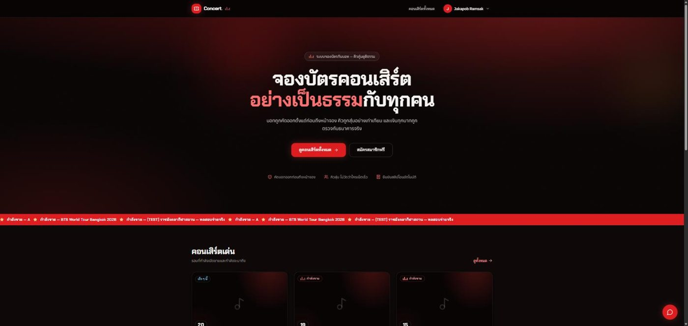
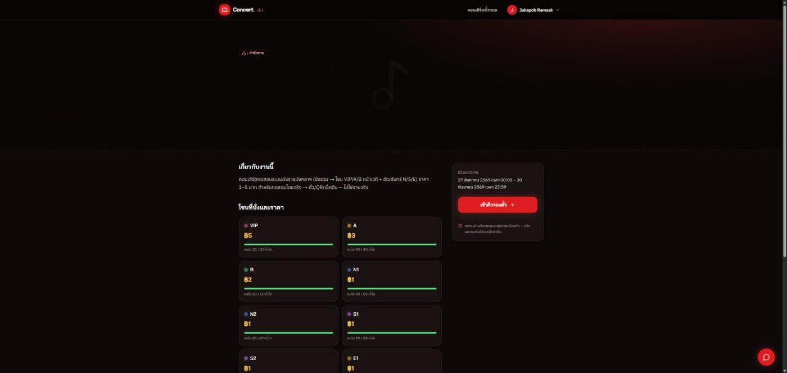
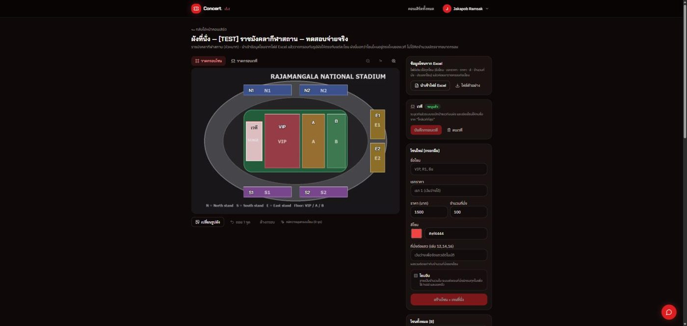
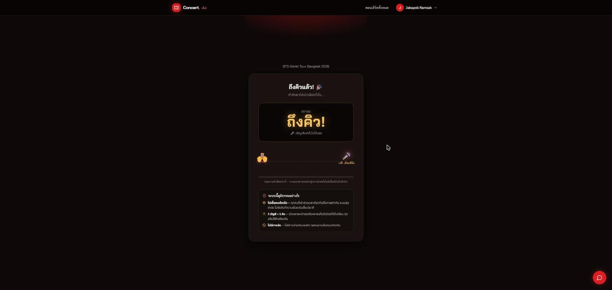
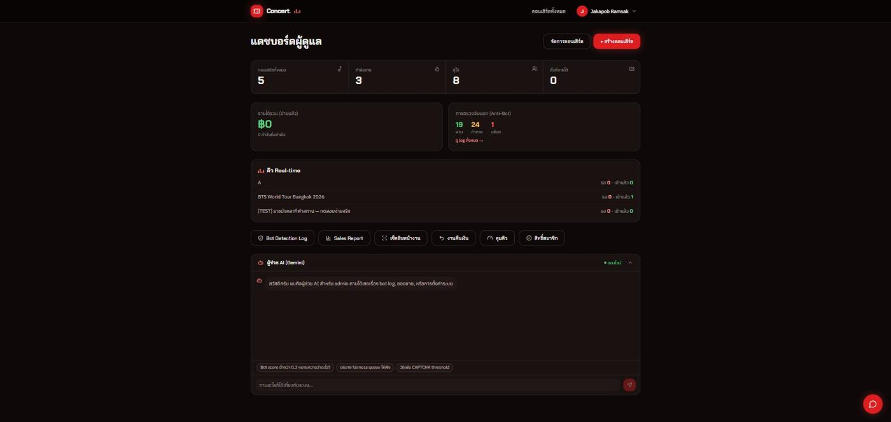
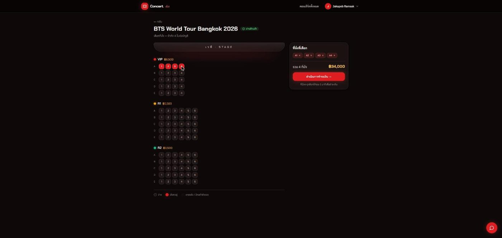
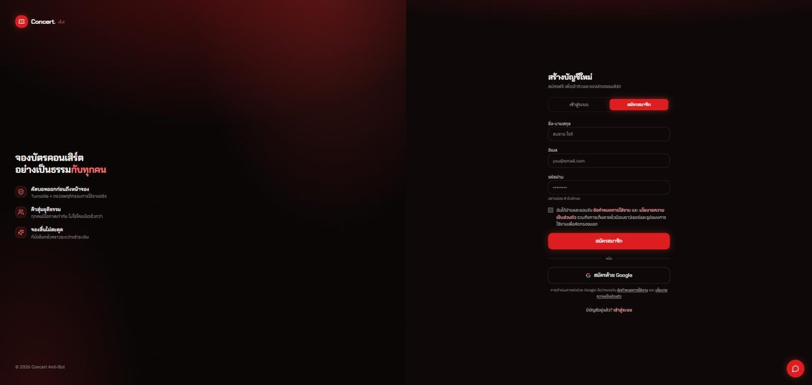
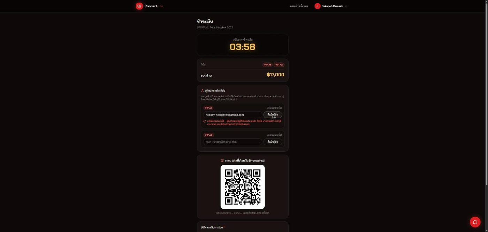

# 🎫 Concert Anti-Bot — ระบบจองบัตรคอนเสิร์ตที่ป้องกันบอทและคิวยุติธรรม

[](https://github.com/jakapobrs-oss/concert-antibot/actions/workflows/ci.yml)
[](https://github.com/jakapobrs-oss/concert-antibot/actions/workflows/backup-neon.yml)
[](https://concert-antibot.vercel.app)

> ปริญญานิพนธ์ วิทยาการคอมพิวเตอร์ · ต่อยอดจากงานวิจัย "ระบบแอนติบอทเพื่อวิเคราะห์การป้องกันบอทในการจองบัตรคอนเสิร์ต"
> เว็บจองบัตรที่ **คัดบอทออกก่อนถึงหน้าจอง** · **คิวสุ่มอย่างเท่าเทียม** (ไม่วัดว่าใครกดเร็ว) · **รับเงินจริงผ่าน PromptPay + ตรวจสลิปอัตโนมัติ** · **บัตรระบุชื่อ + QR เช็คอิน** กันการขายต่อ

🌐 **Demo:** https://concert-antibot.vercel.app — เข้าด้วย Google ได้ทันที · คอนเสิร์ตทดสอบ `[TEST] ราชมังคลากีฬาสถาน` ราคา ฿1–5 ใช้โอนจริงเพื่อดูครบวงจร (ตั๋ว → QR → เช็คอิน)



---

## ระบบทำอะไร (ภาพรวม 1 นาที)

```
ผู้ซื้อ ─→ ห้องรอ (Turnstile + คะแนนบอท) ─→ คิวสุ่มยุติธรรม ─→ เลือกที่นั่งจากผังสถานที่จริง
      ─→ PromptPay QR ─→ อัปสลิป → EasySlip ตรวจยอด/บัญชี/เวลา ─→ ตั๋วระบุชื่อ + QR ─→ เช็คอินหน้างาน
แอดมิน ─→ สร้างคอนเสิร์ต → อัปรูปผัง + นำเข้าโซนจาก Excel → วาดกรอบโซน → เปิดขาย → คุมคิวสด → ดู bot log / ยอดขาย / คืนเงิน
```

| หัวใจของระบบ | ทำอย่างไร | อ่านต่อ |
|---|---|---|
| **กันบอท 2 ชั้น** | ชั้น 1 ให้คะแนนตอนเข้าคิวและตอนกดซื้อ (Cloudflare Turnstile + UA/headers + fingerprint) → ปล่อย / ท้าทาย / บล็อก · ชั้น 2 วิเคราะห์พฤติกรรมบนหน้าเลือกที่นั่งแบบ escalate-only | [docs/25 §…](docs/25_SEATMAP.md) · `lib/antibot*.ts` |
| **คิวยุติธรรม** | ตำแหน่งคิว = `timeBucket` + `randomScore` (HMAC ต่อผู้ใช้+คอนเสิร์ต — ออกแล้วเข้าใหม่ไม่ได้ re-roll) · ปล่อยเข้าห้องเลือกที่นั่งตามความจุจริง (capacity-aware) · แผงแอดมินหยุด/ปล่อยคิวสด | `lib/queue.ts`, `lib/admit-policy.ts` |
| **จ่ายเงินจริงแบบ fail-closed** | PromptPay QR (ฟรี ไม่ผ่าน gateway) → ตรวจสลิปกับ EasySlip: ยอด (สตางค์) · บัญชีปลายทางทุกหลักที่เห็น + ชื่อผู้รับ · เวลาโอนอยู่ในช่วงออเดอร์ · กันสลิปซ้ำ · เพดานต่อบัญชีผู้จ่าย (กันฟาร์มบัญชี) | [docs/15 Payment Security](docs/15_PAYMENT_SECURITY.md) |
| **บัตรระบุชื่อ กันตั๋วผี** | ผู้ถือบัตรต้องมีบัญชี (อายุขั้นต่ำ) · QR ลับต่อใบ · คืนบัตรกลับเข้าระบบเท่านั้น ไม่มีตลาดขายต่อ | [docs/19](docs/19_NAMED_TICKET_PLAN.md) |
| **ผังที่นั่งจากรูปสถานที่จริง** | แอดมินอัปรูปผัง → นำเข้าโซน/ราคา/จำนวนจาก Excel → วาดกรอบทับรูป → ระบบเสนอจำนวนที่นั่งต่อแถวจากรูปทรงกรอบ · ผู้ซื้อเห็นผังรวม → เจาะโซน → เลือกที่นั่ง/โซนยืน/ให้ระบบเลือก | [docs/25 Seatmap](docs/25_SEATMAP.md) |
| **สมาชิก + รอบพรีเซล** | สิทธิ์สมาชิก = เข้ารอบขายก่อน (ไม่แซงคิว ไม่ลดราคา) · รอบหลายชั้น + ลงทะเบียนล่วงหน้า + โค้ดสิทธิ์ · บัตรหมด = รอบถัดไปไม่เปิดเอง | [docs/20](docs/20_MEMBERSHIP.md) · [21](docs/21_PRESALE_ROUNDS.md) · [23](docs/23_SOLD_OUT.md) |

---

## ภาพหน้าจอ (production)

| ผู้ซื้อ | แอดมิน |
|---|---|
|  |  |
|  |  |
|  |  |
|  | |

---

## Tech stack (ของจริงที่ใช้)

- **Next.js 15 (App Router) · React 19 · TypeScript 5.6** — Server Actions สำหรับฟอร์ม/เงิน, Edge middleware สำหรับสิทธิ์ + โฮสต์หลัก
- **PostgreSQL (Neon) + Prisma 6** — 21 models · migration 15 ชุด รันอัตโนมัติตอน deploy
- **Redis (Upstash) ผ่าน ioredis** — คิว / seat-hold (`SET NX` + Lua all-or-nothing) / rate-limit / load-shed เขียนเองทั้งหมด (ไม่ใช้ BullMQ)
- **Auth.js v5** — อีเมล+รหัส (argon2id, บังคับยืนยันอีเมล, ลืมรหัสผ่าน/ขอลิงก์ยืนยันใหม่) + Google OAuth (ปิด auto-link กัน takeover) · อีเมลใบเสร็จหลังจ่ายผ่าน Resend
- **Cloudflare Turnstile + FingerprintJS OSS** + scoring/behavior เขียนเอง — ผูก `action` + `hostname` กับด่าน
- **PromptPay QR (`promptpay-qr`) + EasySlip REST** — ไม่มี payment gateway ไม่มี Stripe/Omise
- **Resend** (อีเมล, REST) · **Gemini** (ผู้ช่วยแชต stateless) · **Tailwind 4 + shadcn/ui**
- **Deploy:** Vercel (Hobby) + Neon + Upstash · cron รายวันกวาดออเดอร์ค้าง · `GET /api/health` สำหรับ uptime monitor · backup DB รายวันเข้ารหัสผ่าน GitHub Actions

---

## รันบนเครื่อง

```bash
# ต้องมี Node 22+, pnpm 9.15+, Docker Desktop (Postgres 16 + Redis)
cp .env.example .env     # dev รันได้โดยไม่มีคีย์จริง (สลิป = mock, CAPTCHA = test key, อีเมล = ลิงก์ใน console)
pnpm install
pnpm db:up               # Postgres + Redis
pnpm db:migrate
pnpm db:seed             # admin@local / user@local + คอนเสิร์ตเดโม (เฉพาะเครื่อง dev — บน Vercel seed ไม่สร้างบัญชีสาธารณะ)
pnpm dev                 # http://localhost:3000
pnpm check:env           # ตรวจว่า env ครบสำหรับโหมดที่ตั้งใจ (dev / prod)
```

ตัวแปรสำคัญตอนใช้จริง (ดู [`docs/17_GO_LIVE_CHECKLIST.md`](docs/17_GO_LIVE_CHECKLIST.md)): `PROMPTPAY_ID` `EASYSLIP_API_KEY` `PAYMENTS_RECEIVER_NAME` · `TURNSTILE_*` คีย์จริง · `SEED_ADMIN_EMAIL/PASSWORD` (แอดมินบน prod) · `CRON_SECRET` `QUEUE_SCORE_SECRET` · `RESEND_API_KEY` หรือ `EMAIL_VERIFICATION=skip` สำหรับเดโม

---

## การทดสอบ

| ชุด | คำสั่ง | ล่าสุด (2026-08-27) |
|---|---|---|
| Unit — Vitest, mock ล้วน | `pnpm test:run` | ✅ **52 ไฟล์ · 647 เคส** (ตัวเลขล่าสุดดูใน [`CLAUDE.md`](CLAUDE.md) › Test layout) |
| Race / concurrency กับ Postgres + Redis จริง | `pnpm test:race` (+ `scripts/test-*.ts`) | ✅ 22/22 |
| เบราว์เซอร์จริง (ผังแอดมิน 43 · ผู้ซื้อ 27 · รอบพรีเซล 10 · ด่านบอทตอนซื้อ 7 · ห้องรอตอนบัตรหมด 5) | `pnpm test:seatmap` ฯลฯ | ✅ |
| Adversarial self-test — บอท Playwright ยิงระบบตัวเอง | `scripts/attack-bot.ts` (localhost) | 0/1 ได้ตั๋ว (ตายที่ประตูคิว) |
| Load — k6 | `pnpm test:load` | ตามต้องการ |
| Typecheck / Lint | `pnpm typecheck` · `pnpm lint` | 0 error |

CI (`.github/workflows/ci.yml`) รัน typecheck + lint + unit ทุก push และ race test + `next build` กับ Postgres/Redis จริง

---

## ความปลอดภัย

- Threat model การเงิน T1–T10 + การแก้: [`docs/15`](docs/15_PAYMENT_SECURITY.md) · audit: [`docs/18`](docs/18_SECURITY_AUDIT.md) · backlog + การตัดสินใจที่บันทึกไว้: [`docs/SECURITY_TODO.md`](docs/SECURITY_TODO.md)
- รีวิวแบบ cross-vendor (Claude + Codex/GPT) ครบ 7 ระบบย่อย · user-test ทุกเส้นทางบน production ผ่านเบราว์เซอร์จริง (27 journey, 2026-08-26)
- หลัก fail-closed: ไม่มีคีย์ตรวจสลิป = ปฏิเสธการจ่าย · ไม่มี Turnstile จริงบน production = ปฏิเสธ · ไม่มีอีเมล = ปิดรับสมัคร (เว้นแต่ตั้งโหมดเดโมชัดเจน) · seed บน deploy ที่โฮสต์ไม่สร้างบัญชีรหัสสาธารณะ
- Security headers (CSP/HSTS/frame-deny), rate-limit ต่อ IP/อีเมล/token, ล็อกบัญชีเมื่อเดารหัส, log error ฝั่ง server แบบมี request id (`instrumentation.ts`)

---

## เอกสาร

เริ่มที่ [`docs/00_README.md`](docs/00_README.md) (ดัชนี) · ข้อเท็จจริงที่ตรงโค้ดสำหรับเล่ม: [`docs/THESIS_GUIDE.md`](docs/THESIS_GUIDE.md) · requirement ทั้งหมด: [`docs/11`](docs/11_REQUIREMENTS.md) · ประวัติการแก้ทุก revision: [`docs/12_CHANGELOG.md`](docs/12_CHANGELOG.md) · แผนที่ไฟล์สำหรับคนใหม่/AI: [`CLAUDE.md`](CLAUDE.md)

## ข้อจำกัดที่ตั้งใจ

- รับเฉพาะ **THB / PromptPay** · ไม่มีตลาดขายต่อ (คืนบัตรเข้าระบบเท่านั้น) · ผังเป็นระดับโซน (ที่นั่งในโซนจัดแถวจากกรอบ ไม่ใช่ตำแหน่งจริงรายเก้าอี้)
- Vercel Hobby: cron ได้วันละครั้ง, ไม่มี WebSocket (ห้องรอใช้ polling) · ผู้ช่วย AI เป็น stateless
- ไฟล์ `วิจัยระบบแอนติบอท finish.docx` ใน root = งานวิจัยต้นทาง อ่านอย่างเดียว

## สัญญาอนุญาต

ยังไม่กำหนด (โปรเจกต์จบ — ดูไฟล์ `LICENSE` เมื่อเพิ่มแล้ว)
