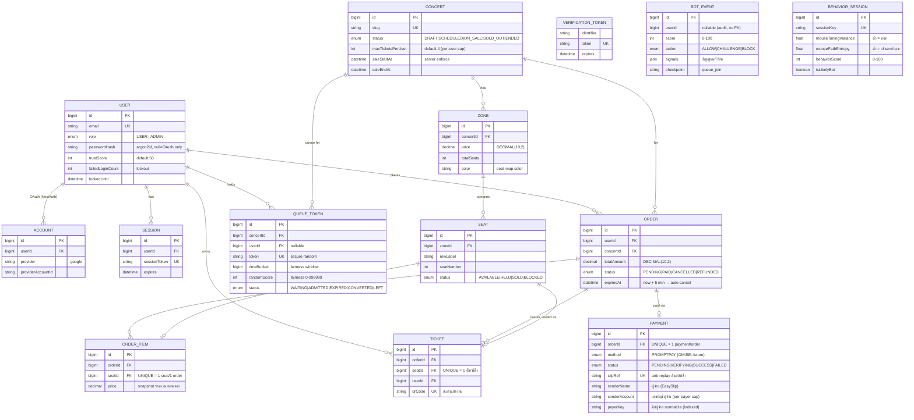

# 04 — ER Diagram

> ✅ **ฉบับนี้ regenerate จาก `prisma/schema.prisma` จริง (14 models) — อัปเดต 2026-06-07**
> ตรงกับ canonical ใน [THESIS_GUIDE.md §3](THESIS_GUIDE.md) — ใช้รูปในไฟล์นี้เข้าเล่มได้เลย
>
> **Database:** PostgreSQL 16 · ทุก primary key เป็น `BigInt @default(autoincrement())` (= `BIGSERIAL`) · เงินเป็น `DECIMAL(10,2)` THB
>
> ⚠️ ฉบับร่างเดิม (ก่อน 2026-06-07) มี **ตารางผี 6 ตัวที่ไม่มีในโค้ดจริง** (`ADMIN`, `SEAT_HOLD`, `REPORT`, `AUDIT_LOG`, `USER_OAUTH`, `BOT_DETECTION_LOG`) + ตั้งชื่อ PK/column ผิด — แก้ทั้งหมดแล้วในไฟล์นี้ (ดู §7)

---

## 1. ภาพรวม ER (Mermaid)

> **การอ่าน cardinality (crow's foot):** `||--o{` = one-to-many (ฝั่ง `o{` มีได้ 0..หลาย) · `||--o|` = one-to-(zero-or-one) · `||--||` = one-to-one บังคับ
> **`VERIFICATION_TOKEN`, `BOT_EVENT`, `BEHAVIOR_SESSION`** ไม่มีเส้นโยง = เป็นตารางยืนอิสระ (ไม่มี foreign key ผูก — ดู §6)

---

## 2. รายละเอียดแต่ละตาราง (14 models)

> ชื่อ column = ชื่อจริงใน DB (camelCase ตาม Prisma) · ชื่อตาราง = `@@map` ในวงเล็บ

### 🔐 กลุ่ม Auth (Phase 2 — NextAuth v5 + Email/Password)

#### 2.1 `User` (`users`)
| Field | Type | Key/Constraint | Description |
|---|---|---|---|
| id | BigInt | **PK** auto | |
| email | String | **UNIQUE**, indexed | อีเมล (dev ใช้ `@local`) |
| emailVerified | DateTime? | | เวลายืนยันอีเมล |
| name | String? | | ชื่อแสดง |
| phone | String? | | เบอร์ |
| image | String? | | รูปโปรไฟล์ |
| passwordHash | String? | | argon2id — `null` ถ้า login ผ่าน Google เท่านั้น |
| role | UserRole | DEFAULT `USER` | `USER` / `ADMIN` (RBAC — **ไม่มีตาราง Admin แยก**) |
| trustScore | Int | DEFAULT 50 | 0-100, เก็บไว้ทำ anti-bot escalation |
| failedLoginCount | Int | DEFAULT 0 | กัน brute-force |
| lockedUntil | DateTime? | | ถ้า login ผิดเกิน → lock |
| lastLoginAt | DateTime? | | |
| createdAt / updatedAt | DateTime | | |

Relations: `accounts[]`, `sessions[]`, `orders[]`, `queueTokens[]`, `tickets[]`

#### 2.2 `Account` (`accounts`) — OAuth link (Google) ตามมาตรฐาน NextAuth
| Field | Type | Key/Constraint | Description |
|---|---|---|---|
| id | BigInt | **PK** | |
| userId | BigInt | **FK** → User (cascade) | |
| type / provider / providerAccountId | String | UNIQUE `[provider, providerAccountId]` | |
| refresh_token / access_token / id_token | String? (Text) | | token จาก provider |
| expires_at | Int? | | |
| token_type / scope / session_state | String? | | |

#### 2.3 `Session` (`sessions`)
| Field | Type | Key/Constraint | Description |
|---|---|---|---|
| id | BigInt | **PK** | |
| sessionToken | String | **UNIQUE** | |
| userId | BigInt | **FK** → User (cascade) | |
| expires | DateTime | | |

#### 2.4 `VerificationToken` (`verification_tokens`) — ตารางยืนอิสระ (ไม่มี FK)
| Field | Type | Key/Constraint | Description |
|---|---|---|---|
| identifier | String | UNIQUE `[identifier, token]` | |
| token | String | **UNIQUE** | |
| expires | DateTime | | |

---

### 🎤 กลุ่ม Catalog (Phase 3 — งาน + โซน + ที่นั่ง)

#### 2.5 `Concert` (`concerts`)
| Field | Type | Key/Constraint | Description |
|---|---|---|---|
| id | BigInt | **PK** | |
| title | VARCHAR(255) | | |
| slug | VARCHAR(255) | **UNIQUE**, indexed | URL-friendly |
| description | TEXT | | |
| coverImageUrl | VARCHAR(500)? | | |
| venue | VARCHAR(255) | | สถานที่ |
| eventAt | DateTime | | วันงาน |
| saleStartAt / saleEndAt | DateTime | indexed `[status, saleStartAt]` | **เปิด/ปิดขาย — server enforce** |
| maxTicketsPerUser | Int | DEFAULT 4 | per-user cap (F2) |
| status | ConcertStatus | DEFAULT `DRAFT` | |
| createdAt / updatedAt | DateTime | | |

Relations: `zones[]`, `orders[]`, `queueTokens[]`

#### 2.6 `Zone` (`zones`)
| Field | Type | Key/Constraint | Description |
|---|---|---|---|
| id | BigInt | **PK** | |
| concertId | BigInt | **FK** → Concert (cascade), indexed | |
| name | VARCHAR(50) | | VIP, R1, R2 |
| description | VARCHAR(255)? | | |
| price | DECIMAL(10,2) | | THB |
| totalSeats | Int | | |
| color | VARCHAR(7) | DEFAULT `#ef4444` | สีบน seat map |

#### 2.7 `Seat` (`seats`)
| Field | Type | Key/Constraint | Description |
|---|---|---|---|
| id | BigInt | **PK** | |
| zoneId | BigInt | **FK** → Zone (cascade) | |
| rowLabel | VARCHAR(10) | UNIQUE `[zoneId, rowLabel, seatNumber]` | A, B, C... |
| seatNumber | Int | indexed `[zoneId, status]` | |
| status | SeatStatus | DEFAULT `AVAILABLE` | `HELD` sync จาก Redis ตอนยืนยันจ่าย |
| createdAt | DateTime | | |

Relations: `orderItem?` (1:0..1), `ticket?` (1:0..1)

---

### 🎫 กลุ่ม Booking (Phase 3 + 7 — order → payment → ticket)

#### 2.8 `Order` (`orders`)
| Field | Type | Key/Constraint | Description |
|---|---|---|---|
| id | BigInt | **PK** | |
| userId | BigInt | **FK** → User, indexed `[userId, status]` | |
| concertId | BigInt | **FK** → Concert | |
| totalAmount | DECIMAL(10,2) | | |
| currency | VARCHAR(3) | DEFAULT `THB` | |
| status | OrderStatus | DEFAULT `PENDING`, indexed `[status, expiresAt]` | |
| createdAt / paidAt | DateTime / DateTime? | | |
| expiresAt | DateTime | | PENDING เกินเวลานี้ → cancel อัตโนมัติ (sweeper) |

Relations: `items[]`, `payment?`, `tickets[]`

#### 2.9 `OrderItem` (`order_items`)
| Field | Type | Key/Constraint | Description |
|---|---|---|---|
| id | BigInt | **PK** | |
| orderId | BigInt | **FK** → Order (cascade), indexed | |
| seatId | BigInt | **FK** → Seat, **UNIQUE** | 1 ที่นั่ง = 1 order item (กันจองซ้ำ) |
| price | DECIMAL(10,2) | | snapshot ราคา |

#### 2.10 `Payment` (`payments`) — PromptPay + EasySlip verify
| Field | Type | Key/Constraint | Description |
|---|---|---|---|
| id | BigInt | **PK** | |
| orderId | BigInt | **FK** → Order (cascade), **UNIQUE** | 1 order = 1 payment |
| method | PaymentMethod | DEFAULT `PROMPTPAY` | |
| amount | DECIMAL(10,2) | | |
| currency | VARCHAR(3) | DEFAULT `THB` | |
| status | PaymentStatus | DEFAULT `PENDING`, indexed | |
| slipRef | VARCHAR(255)? | **UNIQUE** | transaction id จากธนาคาร — **กันใช้สลิปซ้ำ (anti-replay)** |
| slipImageUrl | VARCHAR(500)? | | เก็บใน MinIO |
| senderName | VARCHAR(255)? | | ชื่อผู้โอน (จาก EasySlip) |
| **senderAccount** | VARCHAR(255)? | | เลขบัญชี/พร็อกซีผู้จ่าย (มัก masked) — **per-payer cap** |
| **payerKey** | VARCHAR(255)? | **indexed** | คีย์ผู้จ่าย normalize (`acct:<เลข>` / `name:<ชื่อ>`) — นับตั๋วต่อผู้จ่าย กัน account farming |
| paidAt / createdAt | DateTime? / DateTime | | |

#### 2.11 `Ticket` (`tickets`) — ออกหลังจ่ายสำเร็จ
| Field | Type | Key/Constraint | Description |
|---|---|---|---|
| id | BigInt | **PK** | |
| orderId | BigInt | **FK** → Order, indexed | |
| seatId | BigInt | **FK** → Seat, **UNIQUE** | 1 ที่นั่งออกตั๋วได้ครั้งเดียว |
| userId | BigInt | **FK** → User, indexed | |
| qrCode | VARCHAR(255) | **UNIQUE** | สแกนตอนเข้างาน |
| price | DECIMAL(10,2) | | snapshot |
| issuedAt | DateTime | | |

---

### 🚦 กลุ่ม Queue + Anti-bot (Phase 4-6 — audit/telemetry)

#### 2.12 `QueueToken` (`queue_tokens`) — Virtual Waiting Room (snapshot/audit)
> ⚠️ กลไกคิวจริง (ลำดับ + ปล่อย batch) อยู่ใน **Redis**; ตารางนี้เก็บ snapshot ไว้พิสูจน์ fairness ใน thesis + กู้คืน

| Field | Type | Key/Constraint | Description |
|---|---|---|---|
| id | BigInt | **PK** | |
| token | VARCHAR(64) | **UNIQUE**, indexed | secure random — client ถือไว้ |
| concertId | BigInt | **FK** → Concert (cascade), indexed `[concertId, status]` | |
| userId | BigInt? | **FK** → User (setNull) | null ได้ถ้ายังไม่ login |
| fingerprintHash | VARCHAR(64)? | | ผูก device กัน 1 คนถือหลาย slot |
| ip | VARCHAR(45)? | | |
| **timeBucket** | BigInt | | window ที่เข้าคิว — คนใน bucket เดียวกันเสมอภาค |
| **randomScore** | Int | | 0-999999 สุ่มภายใน bucket → ตัดลำดับแบบสุ่ม (ไม่เอาความเร็ว ms) |
| status | QueueTokenStatus | DEFAULT `WAITING` | |
| position | Int? | | ตำแหน่ง snapshot (อาจ stale — ดู Redis สำหรับ real-time) |
| enteredAt / admittedAt / expiresAt | DateTime / DateTime? / DateTime | | |

#### 2.13 `BotEvent` (`bot_events`) — Layer 1 scoring log (ยืนอิสระ, ไม่มี FK)
| Field | Type | Key/Constraint | Description |
|---|---|---|---|
| id | BigInt | **PK** | |
| userId | BigInt? | (column เฉยๆ ไม่มี FK) | null ถ้ายังไม่ login |
| ip | VARCHAR(45)? | | |
| userAgent | VARCHAR(500)? | | |
| fingerprintHash | VARCHAR(64)? | | |
| score | Int | | 0-100 (สูง = น่าจะบอท) |
| action | BotAction | indexed `[action, createdAt]` | |
| signals | Json | | สัญญาณที่ fire เช่น `{turnstile, ua}` |
| checkpoint | VARCHAR(50) | DEFAULT `queue_join` | จุดที่ตรวจ |
| createdAt | DateTime | indexed | |

#### 2.14 `BehaviorSession` (`behavior_sessions`) — Layer 2 behavior (ยืนอิสระ, ไม่มี FK)
| Field | Type | Key/Constraint | Description |
|---|---|---|---|
| id | BigInt | **PK** | |
| sessionKey | VARCHAR(64) | **UNIQUE**, indexed | ผูกกับ queue session ฝั่ง client |
| userId | BigInt? | (column เฉยๆ ไม่มี FK) | |
| mouseMoveCount / keyPressCount | Int | DEFAULT 0 | |
| mouseTimingVariance | Float | DEFAULT 0 | ความแปรปรวน timing — ต่ำ = บอท |
| mousePathEntropy | Float | DEFAULT 0 | entropy ทิศเมาส์ — ต่ำ = เส้นตรง/บอท |
| dwellTimeMs | Int | DEFAULT 0 | เวลาอยู่บนหน้า |
| behaviorScore | Int | DEFAULT 0 | 0-100 |
| isLikelyBot | Boolean | DEFAULT false | |
| createdAt | DateTime | indexed | |

---

## 3. Enums (ทั้งหมด 8 ตัว — ตรง schema)

| Enum | ค่า |
|---|---|
| `UserRole` | `USER`, `ADMIN` |
| `ConcertStatus` | `DRAFT`, `SCHEDULED`, `ON_SALE`, `SOLD_OUT`, `ENDED` |
| `SeatStatus` | `AVAILABLE`, `HELD`, `SOLD`, `BLOCKED` |
| `OrderStatus` | `PENDING`, `PAID`, `CANCELLED`, `REFUNDED` |
| `PaymentMethod` | `PROMPTPAY`, `OMISE` (future) |
| `PaymentStatus` | `PENDING`, `VERIFYING`, `SUCCESS`, `FAILED` |
| `QueueTokenStatus` | `WAITING`, `ADMITTED`, `EXPIRED`, `CONVERTED`, `LEFT` |
| `BotAction` | `ALLOW`, `CHALLENGE`, `BLOCK` |

---

## 4. ความสัมพันธ์ + ON DELETE

| ความสัมพันธ์ | Cardinality | ON DELETE |
|---|---|---|
| User → Account / Session | 1 : 0..* | **Cascade** |
| User → Order / Ticket | 1 : 0..* | Restrict (default) |
| User → QueueToken | 1 : 0..* | **SetNull** (userId nullable) |
| Concert → Zone | 1 : 0..* | **Cascade** |
| Concert → Order / QueueToken | 1 : 0..* | Cascade (QueueToken) / Restrict (Order) |
| Zone → Seat | 1 : 0..* | **Cascade** |
| Order → OrderItem / Payment | 1 : 0..* / 1 : 0..1 | **Cascade** |
| Order → Ticket | 1 : 0..* | Restrict |
| Seat ↔ OrderItem / Ticket | 1 : 0..1 (UNIQUE seatId) | Restrict |

---

## 5. Index Strategy (ตรง schema จริง)

| ตาราง | Index | เหตุผล |
|---|---|---|
| users | `email` | login lookup |
| concerts | `slug`, `[status, saleStartAt]` | หาคอนเสิร์ตที่กำลังขาย |
| zones | `concertId` | |
| seats | `[zoneId, rowLabel, seatNumber]` UNIQUE, `[zoneId, status]` | กันที่นั่งซ้ำ + หาที่ว่าง |
| orders | `[userId, status]`, `[status, expiresAt]` | sweeper หา order หมดอายุ |
| order_items | `orderId`, `seatId` UNIQUE | กันจองที่นั่งซ้ำในคนละ order |
| payments | `slipRef` UNIQUE, `status`, **`payerKey`** | anti-replay สลิป + นับตั๋วต่อผู้จ่าย |
| tickets | `seatId` UNIQUE, `qrCode` UNIQUE, `userId`, `orderId` | กันออกตั๋วซ้ำ |
| queue_tokens | `token` UNIQUE, `[concertId, status]` | |
| bot_events | `createdAt`, `[action, createdAt]` | dashboard |
| behavior_sessions | `sessionKey` UNIQUE, `createdAt` | |

---

## 6. หมายเหตุสำคัญ (เขียนใต้รูปในเล่ม)

1. **ไม่มีตาราง `SeatHold`** — การ hold ที่นั่งชั่วคราวอยู่ใน **Redis** (`SET NX`, TTL 300s) เพื่อความเร็ว + atomic กัน race; DB เก็บแค่ `Seat.status = HELD` ตอนยืนยันจ่ายเงิน
2. **`BotEvent` + `BehaviorSession` เป็นตาราง audit/telemetry ยืนอิสระ** (ไม่มี FK ผูกกับ User) — เก็บผลประเมินบอท Layer 1 (scoring) / Layer 2 (behavior) ไว้ทำ dashboard + วิเคราะห์ thesis โดยไม่บังคับว่าต้อง login
3. **`admin` ไม่ใช่ตารางแยก** — ใช้ `User.role = ADMIN` (RBAC) ครอบ `/admin/*`
4. **per-payer cap (กัน account farming):** `Payment.payerKey` (มี index) นับตั๋วต่อ "บัญชีผู้จ่าย" ข้ามทุก app account — บังคับที่ชั้น payment ซึ่งบอทปลอมไม่ได้ (ต้องโอนเงินจริง + slipRef unique)
5. **คิว fairness:** `QueueToken.timeBucket` + `randomScore` พิสูจน์ว่าจัดลำดับด้วยช่วงเวลา (bucket) + สุ่ม ไม่ใช่ "ใครเร็วระดับ ms ชนะ"

---

## 7. สิ่งที่แก้จากฉบับร่างเดิม (changelog)

| ฉบับร่างเดิม (ผิด) | ของจริงในโค้ด |
|---|---|
| ตาราง `ADMIN` แยก | ❌ ไม่มี — ใช้ `User.role = ADMIN` |
| ตาราง `SEAT_HOLD` ใน DB | ❌ ไม่มี — hold อยู่ใน Redis |
| ตาราง `REPORT`, `AUDIT_LOG` | ❌ ไม่มีในโค้ด |
| `USER_OAUTH` | → ชื่อจริงคือ `Account` (NextAuth) |
| `BOT_DETECTION_LOG` (มี `reason`) | → ชื่อจริงคือ `BotEvent` (มี `signals` Json + `checkpoint`) |
| `BEHAVIOR_EVENT` (raw event/pixel) | → ชื่อจริงคือ `BehaviorSession` (เก็บ feature สรุป ไม่ใช่ raw) |
| PK ชื่อ `user_id`, `concert_id`... | → ทุกตารางใช้ `id` (Prisma convention) |
| `Payment.provider_ref` | → `slipRef` (+ `senderName`, `senderAccount`, `payerKey`) |
| `QueueToken.position` only | → เพิ่ม `timeBucket`, `randomScore`, `status` (fairness) |
| ขาด `OrderItem`, `VerificationToken` | → มีจริงทั้งคู่ (เพิ่มแล้ว) |

> รวม **14 models** · 8 enums · seat hold = Redis · ภาพ ER ส่งออกเป็นไฟล์ที่ [`docs/diagrams/`](diagrams/)
