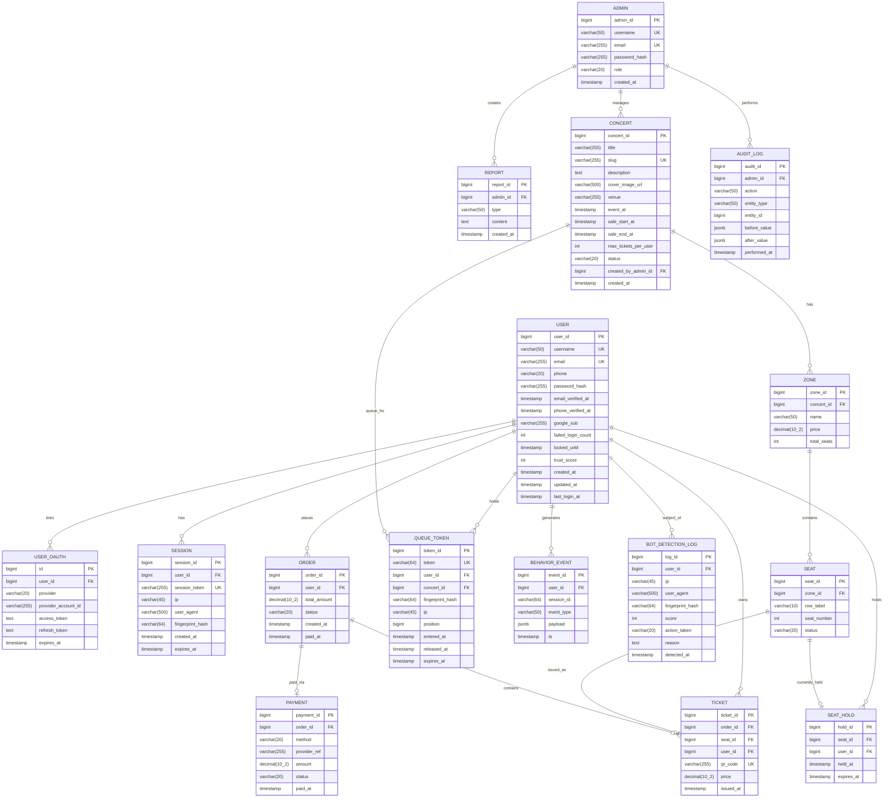

# 04 — ER Diagram

> Database: PostgreSQL 16 (หรือ MySQL 8.4 ตามวิจัยเดิม)
> ทุก primary key เป็น `BIGSERIAL` (Postgres) / `BIGINT AUTO_INCREMENT` (MySQL) — ตัวเลข ตามที่ user ขอ
> Foreign keys ใช้ ON DELETE rules ที่เหมาะสม (cascade / restrict / set null)

---

## 1. ภาพรวม ER (Mermaid)



---

## 2. รายละเอียดแต่ละตาราง

### 2.1 USER — ผู้ใช้งานปลายทาง
| Field | Type | Constraint | Description |
|---|---|---|---|
| user_id | BIGSERIAL | PK | ตัวเลข auto-increment |
| username | VARCHAR(50) | UNIQUE, NOT NULL | ชื่อ login |
| email | VARCHAR(255) | UNIQUE, NOT NULL | อีเมล |
| phone | VARCHAR(20) | NULL | เบอร์ (ใช้ OTP) |
| password_hash | VARCHAR(255) | NULL | argon2id (NULL ถ้า login ผ่าน Google) |
| email_verified_at | TIMESTAMP | NULL | เวลายืนยันอีเมล |
| phone_verified_at | TIMESTAMP | NULL | เวลายืนยันเบอร์ |
| google_sub | VARCHAR(255) | UNIQUE NULL | Google subject id |
| failed_login_count | INT | DEFAULT 0 | นับ login ผิด |
| locked_until | TIMESTAMP | NULL | ถ้าผิดเกิน lock |
| trust_score | INT | DEFAULT 50 | 0-100, ใช้ตัดสินใจ anti-bot |
| created_at | TIMESTAMP | DEFAULT NOW | |
| updated_at | TIMESTAMP | | |
| last_login_at | TIMESTAMP | NULL | |

Indexes: `email`, `username`, `google_sub`

---

### 2.2 ADMIN
| Field | Type | Description |
|---|---|---|
| admin_id | BIGSERIAL PK | |
| username | VARCHAR(50) UNIQUE | |
| email | VARCHAR(255) UNIQUE | |
| password_hash | VARCHAR(255) | argon2id |
| role | VARCHAR(20) | super_admin / editor / viewer |
| created_at | TIMESTAMP | |

---

### 2.3 CONCERT
| Field | Type | Description |
|---|---|---|
| concert_id | BIGSERIAL PK | |
| title | VARCHAR(255) | ชื่อคอนเสิร์ต |
| slug | VARCHAR(255) UNIQUE | URL-friendly |
| description | TEXT | |
| cover_image_url | VARCHAR(500) | |
| venue | VARCHAR(255) | สถานที่ |
| event_at | TIMESTAMP | วันงาน |
| sale_start_at | TIMESTAMP | **เปิดขายตอนไหน — server enforce** |
| sale_end_at | TIMESTAMP | |
| max_tickets_per_user | INT DEFAULT 4 | จำกัดต่อ account |
| status | VARCHAR(20) | draft / scheduled / on_sale / sold_out / ended |
| created_by_admin_id | BIGINT FK | |
| created_at | TIMESTAMP | |

Indexes: `slug`, `sale_start_at`, `status`

---

### 2.4 ZONE & SEAT
**ZONE**
| Field | Type | Description |
|---|---|---|
| zone_id | BIGSERIAL PK | |
| concert_id | BIGINT FK CASCADE | |
| name | VARCHAR(50) | เช่น VIP, R1, R2 |
| price | DECIMAL(10,2) | |
| total_seats | INT | |

**SEAT**
| Field | Type | Description |
|---|---|---|
| seat_id | BIGSERIAL PK | |
| zone_id | BIGINT FK CASCADE | |
| row_label | VARCHAR(10) | เช่น A, B |
| seat_number | INT | |
| status | VARCHAR(20) | available / held / sold |

Indexes: `(zone_id, status)` partial index where status='available'

---

### 2.5 QUEUE_TOKEN — Virtual Waiting Room
| Field | Type | Description |
|---|---|---|
| token_id | BIGSERIAL PK | |
| token | VARCHAR(64) UNIQUE | secure random token |
| user_id | BIGINT FK NULL | NULL ถ้ายังไม่ login |
| concert_id | BIGINT FK | |
| fingerprint_hash | VARCHAR(64) | ผูกกับ device |
| ip | VARCHAR(45) | |
| position | BIGINT | ตำแหน่งในคิว |
| entered_at | TIMESTAMP | |
| released_at | TIMESTAMP NULL | เวลาปล่อยเข้าจอง |
| expires_at | TIMESTAMP | TTL ของ token |

Indexes: `token`, `(concert_id, position)`

---

### 2.6 SEAT_HOLD — Lock ที่นั่งชั่วคราว
| Field | Type | Description |
|---|---|---|
| hold_id | BIGSERIAL PK | |
| seat_id | BIGINT FK | UNIQUE constraint partial: 1 seat มี hold ได้ทีเดียว |
| user_id | BIGINT FK | |
| held_at | TIMESTAMP | |
| expires_at | TIMESTAMP | DEFAULT now + 5 min |

> **กลไกจริงใช้ Redis (เร็วกว่า)** ตารางนี้ backup audit ใน DB

---

### 2.7 ORDER & TICKET & PAYMENT
**ORDER**
| Field | Type | Description |
|---|---|---|
| order_id | BIGSERIAL PK | |
| user_id | BIGINT FK | |
| total_amount | DECIMAL(10,2) | |
| status | VARCHAR(20) | pending / paid / cancelled / refunded |
| created_at | TIMESTAMP | |
| paid_at | TIMESTAMP NULL | |

**TICKET**
| Field | Type | Description |
|---|---|---|
| ticket_id | BIGSERIAL PK | |
| order_id | BIGINT FK | |
| seat_id | BIGINT FK UNIQUE | seat ออกตั๋วได้ครั้งเดียว |
| user_id | BIGINT FK | |
| qr_code | VARCHAR(255) UNIQUE | สแกนตอนเข้างาน |
| price | DECIMAL(10,2) | snapshot price |
| issued_at | TIMESTAMP | |

**PAYMENT**
| Field | Type | Description |
|---|---|---|
| payment_id | BIGSERIAL PK | |
| order_id | BIGINT FK | |
| method | VARCHAR(20) | mock / stripe / omise / promptpay |
| provider_ref | VARCHAR(255) | transaction id ของ provider |
| amount | DECIMAL(10,2) | |
| status | VARCHAR(20) | pending / success / failed |
| paid_at | TIMESTAMP | |

---

### 2.8 BEHAVIOR_EVENT — เก็บ raw event ไป train ML
| Field | Type | Description |
|---|---|---|
| event_id | BIGSERIAL PK | |
| user_id | BIGINT FK NULL | |
| session_id | VARCHAR(64) | |
| event_type | VARCHAR(50) | mouse_move / key_press / scroll / click / page_visit |
| payload | JSONB | flexible (x, y, key, duration, etc.) |
| ts | TIMESTAMP | |

Indexes: `(session_id, ts)`, `event_type` — partition by month เมื่อเยอะ

---

### 2.9 BOT_DETECTION_LOG
| Field | Type | Description |
|---|---|---|
| log_id | BIGSERIAL PK | |
| user_id | BIGINT FK NULL | NULL ถ้ายังไม่ login |
| ip | VARCHAR(45) | |
| user_agent | VARCHAR(500) | |
| fingerprint_hash | VARCHAR(64) | |
| score | INT | 0-100, ยิ่งสูงยิ่งน่าจะเป็นบอท |
| action_taken | VARCHAR(20) | allow / challenge / block |
| reason | TEXT | สรุปเหตุผล (rule fired) |
| detected_at | TIMESTAMP | |

---

### 2.10 REPORT & AUDIT_LOG
**REPORT** — สรุปที่ admin gen
| Field | Type | Description |
|---|---|---|
| report_id | BIGSERIAL PK | |
| admin_id | BIGINT FK | |
| type | VARCHAR(50) | daily_bot / weekly_sales / etc |
| content | TEXT | markdown หรือ JSON |
| created_at | TIMESTAMP | |

**AUDIT_LOG** — ทุก action ของ admin
| Field | Type | Description |
|---|---|---|
| audit_id | BIGSERIAL PK | |
| admin_id | BIGINT FK | |
| action | VARCHAR(50) | create / update / delete / login |
| entity_type | VARCHAR(50) | concert / seat / user |
| entity_id | BIGINT | |
| before_value | JSONB NULL | |
| after_value | JSONB NULL | |
| performed_at | TIMESTAMP | |

---

## 3. Prisma Schema Skeleton (ตัวอย่าง)

```prisma
// prisma/schema.prisma
generator client { provider = "prisma-client-js" }
datasource db { provider = "postgresql" url = env("DATABASE_URL") }

model User {
  user_id          BigInt    @id @default(autoincrement())
  username         String    @unique @db.VarChar(50)
  email            String    @unique @db.VarChar(255)
  phone            String?   @db.VarChar(20)
  password_hash    String?   @db.VarChar(255)
  email_verified_at DateTime?
  phone_verified_at DateTime?
  google_sub       String?   @unique @db.VarChar(255)
  failed_login_count Int     @default(0)
  locked_until     DateTime?
  trust_score      Int       @default(50)
  created_at       DateTime  @default(now())
  updated_at       DateTime  @updatedAt
  last_login_at    DateTime?

  orders           Order[]
  tickets          Ticket[]
  queueTokens      QueueToken[]
  seatHolds        SeatHold[]
  behaviorEvents   BehaviorEvent[]
  oauth            UserOAuth[]
  sessions         Session[]
}
// ... (อีก ~12 models)
```

> เต็มจะเขียนใน Phase 1 (setup)

---

## 4. Migration Strategy

1. `prisma init` → ตั้ง datasource
2. เพิ่ม models ทีละกลุ่ม commit แยก
   - User/Admin/Session
   - Concert/Zone/Seat
   - Queue/Hold
   - Order/Ticket/Payment
   - Logging
3. `prisma migrate dev --name <feature>` ทุกครั้ง
4. Seed data: `prisma/seed.ts` มี admin + 2 demo concerts

---

## 5. Index Strategy (สำคัญสำหรับ peak load)

```sql
-- ดึงคอนเสิร์ตกำลังเปิดขาย
CREATE INDEX idx_concert_active ON concert (sale_start_at, status) WHERE status = 'on_sale';

-- หาที่นั่งว่าง
CREATE INDEX idx_seat_available ON seat (zone_id) WHERE status = 'available';

-- คิว
CREATE INDEX idx_queue_concert_pos ON queue_token (concert_id, position) WHERE released_at IS NULL;

-- bot log สำหรับ dashboard
CREATE INDEX idx_bot_recent ON bot_detection_log (detected_at DESC);

-- behavior event เร็ว ๆ
CREATE INDEX idx_behavior_session ON behavior_event (session_id, ts DESC);
```
