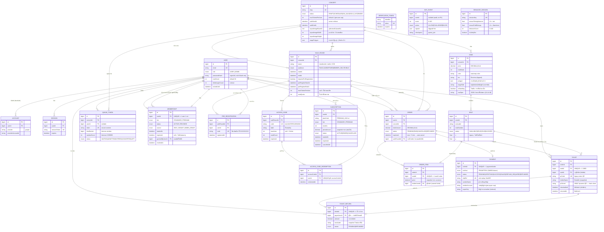

# 04 — ER Diagram

> ✅ **ฉบับนี้ regenerate จาก `prisma/schema.prisma` จริง (21 models) — อัปเดต 2026-08-20 (รอบ 3)**
>
> รอบนี้เพิ่ม 6 ตารางที่ยังไม่เคยอยู่ในเอกสาร: `TicketReturn` (คืนบัตร, 2026-07),
> `Membership` + `SaleRound` (สมาชิก + รอบกดบัตร, Phase 2),
> `PreRegistration` + `AccessCode` + `AccessCodeRedemption` (รอบพรีเซลหลายชั้น, Phase 2.1 — ดู [21](21_PRESALE_ROUNDS.md))
> และคอลัมน์ผังที่นั่งจากรูปใน `Concert`/`Zone`/`Seat`
>
> 🔀 **2026-08-25 merge สาย seatmap + presale**: เพิ่มคอลัมน์ผังรายโซนของสาย seatmap (`Concert.stagePolygon`, `Zone.tier/stageSide/isStanding/rowSpec`) เข้ากับตาราง Phase 2.1–2.2 ของสาย presale — ตรวจกับ `prisma migrate diff` แล้วตรง migration ทั้ง 15 ตัว
> ตรงกับ canonical ใน [THESIS_GUIDE.md §3](THESIS_GUIDE.md) — ใช้รูปในไฟล์นี้เข้าเล่มได้เลย
>
> **Database:** PostgreSQL 16 · ทุก primary key เป็น `BigInt @default(autoincrement())` (= `BIGSERIAL`) · เงินเป็น `DECIMAL(10,2)` THB
>
> ⚠️ ฉบับร่างเดิม (ก่อน 2026-06-07) มี **ตารางผี 6 ตัวที่ไม่มีในโค้ดจริง** (`ADMIN`, `SEAT_HOLD`, `REPORT`, `AUDIT_LOG`, `USER_OAUTH`, `BOT_DETECTION_LOG`) + ตั้งชื่อ PK/column ผิด — แก้ทั้งหมดแล้วในไฟล์นี้ (ดู §7)

---

## 1. ภาพรวม ER (Mermaid)

```mermaid
erDiagram
    USER ||--o{ ACCOUNT : "OAuth (NextAuth)"
    USER ||--o{ SESSION : has
    USER ||--o{ ORDER : places
    USER ||--o{ TICKET : owns
    USER ||--o{ QUEUE_TOKEN : holds
    USER ||--o| MEMBERSHIP : "เป็นสมาชิก"
    USER ||--o{ MEMBERSHIP : "แอดมินให้สิทธิ์ (grantedBy)"
    USER ||--o{ TICKET_RETURN : "รับเงินคืน"
    CONCERT ||--o{ SALE_ROUND : "เปิดรอบขาย"
    SALE_ROUND ||--o{ PRE_REGISTRATION : "ลงทะเบียนล่วงหน้า"
    SALE_ROUND ||--o{ ACCESS_CODE : "โค้ดสิทธิ์"
    ACCESS_CODE ||--o{ ACCESS_CODE_REDEMPTION : "ถูกใช้โดย"
    USER ||--o{ PRE_REGISTRATION : "ลงทะเบียน"
    USER ||--o{ ACCESS_CODE_REDEMPTION : "ใช้โค้ด"
    USER ||--o{ SUBSCRIPTION : "สมัครแพ็กเกจ"
    SALE_ROUND ||--o{ ORDER : "order เกิดในรอบ"
    TICKET ||--o| TICKET_RETURN : "ถูกคืนเป็น"
    CONCERT ||--o{ ZONE : has
    CONCERT ||--o{ ORDER : for
    CONCERT ||--o{ QUEUE_TOKEN : "queue for"
    ZONE ||--o{ SEAT : contains
    ORDER ||--o{ ORDER_ITEM : contains
    ORDER ||--o| PAYMENT : "paid via"
    ORDER ||--o{ TICKET : issues
    SEAT ||--o| ORDER_ITEM : "reserved by"
    SEAT ||--o{ TICKET : "issued as (active 1 ใบ)"
    USER ||--o| MEMBERSHIP : "has"
    CONCERT ||--o{ SALE_ROUND : "opens"
    SALE_ROUND ||--o{ ORDER : "placed in"
    TICKET ||--o| TICKET_RETURN : "returned as"

    USER {
        bigint id PK
        string email UK
        enum role "USER | ADMIN"
        string passwordHash "argon2id, null=OAuth only"
        int trustScore "default 50"
        int failedLoginCount "lockout"
        datetime lockedUntil
    }
    ACCOUNT {
        bigint id PK
        bigint userId FK
        string provider "google"
        string providerAccountId
    }
    SESSION {
        bigint id PK
        bigint userId FK
        string sessionToken UK
        datetime expires
    }
    VERIFICATION_TOKEN {
        string identifier
        string token UK
        datetime expires
    }
    CONCERT {
        bigint id PK
        string slug UK
        enum status "DRAFT|SCHEDULED|ON_SALE|SOLD_OUT|ENDED"
        int maxTicketsPerUser "default 4 (per-user cap)"
        datetime saleStartAt "server enforce"
        datetime saleEndAt
        text layoutImageBase64 "รูปผังสถานที่ (base64)"
        int layoutImageWidth "px หลังย่อ - ตั้ง viewBox"
        int layoutImageHeight
        json stagePolygon "กรอบเวที [[x,y]...] สัดส่วน 0-1"
    }
    ZONE {
        bigint id PK
        bigint concertId FK
        decimal price "DECIMAL(10,2)"
        int totalSeats
        string color "seat-map color"
        string tier "ชื่อเรทราคา (legend)"
        json polygon "กรอบโซนทับรูป สัดส่วน 0-1"
        string stageSide "top|bottom|left|right (override)"
        boolean isStanding "โซนยืน - ขายเป็นจำนวนใบ"
        string rowSpec "JSON จำนวนที่นั่งต่อแถว [12,14,16]"
    }
    SEAT {
        bigint id PK
        bigint zoneId FK
        string rowLabel
        int seatNumber
        enum status "AVAILABLE|HELD|SOLD|BLOCKED"
        float x "legacy - ไม่มีโค้ดใช้แล้ว"
        float y
    }
    ORDER {
        bigint id PK
        bigint userId FK
        bigint concertId FK
        decimal totalAmount "DECIMAL(10,2)"
        enum status "PENDING|PAID|CANCELLED|REFUNDED"
        datetime expiresAt "now + 5 min → auto-cancel"
        bigint saleRoundId FK "รอบที่ order เกิด (audit/สถิติ)"
    }
    ORDER_ITEM {
        bigint id PK
        bigint orderId FK
        bigint seatId FK "UNIQUE = 1 seat/1 order"
        decimal price "snapshot ราคา ณ ตอนจอง"
        bigint holderUserId FK "ผู้ถือบัตร (named ticket)"
    }
    PAYMENT {
        bigint id PK
        bigint orderId FK "UNIQUE = 1 payment/order"
        enum method "PROMPTPAY (OMISE=future)"
        enum status "PENDING|VERIFYING|SUCCESS|FAILED|REFUND_REQUIRED|REFUNDED"
        string slipRef UK "anti-replay กันสลิปซ้ำ"
        string senderName "ผู้จ่าย (EasySlip)"
        string senderAccount "เลขบัญชีผู้จ่าย (per-payer cap)"
        string payerKey "คีย์ผู้จ่าย normalize (indexed)"
    }
    TICKET {
        bigint id PK
        bigint orderId FK
        bigint seatId FK "UNIQUE = 1 ตั๋ว/ที่นั่ง"
        bigint userId FK "= ผู้ถือบัตร (holder)"
        string qrCode UK "legacy static QR"
        string holderName "ชื่อบนบัตร (snapshot)"
        string qrSecret "HMAC dynamic QR — ห้ามส่ง client"
        datetime checkedInAt "เช็คอินแล้ว (ครั้งเดียว)"
        datetime returnedAt "คืนบัตรแล้ว"
    }
    QUEUE_TOKEN {
        bigint id PK
        bigint concertId FK
        bigint userId FK "nullable"
        string token UK "secure random"
        bigint timeBucket "fairness window"
        int randomScore "fairness 0-999999"
        enum status "WAITING|ADMITTED|EXPIRED|CONVERTED|LEFT"
    }
    BOT_EVENT {
        bigint id PK
        bigint userId "nullable (audit, no FK)"
        int score "0-100"
        enum action "ALLOW|CHALLENGE|BLOCK"
        json signals "สัญญาณที่ fire"
        string checkpoint "queue_join"
    }
    BEHAVIOR_SESSION {
        bigint id PK
        string sessionKey UK
        float mouseTimingVariance "ต่ำ = บอท"
        float mousePathEntropy "ต่ำ = เส้นตรง/บอท"
        int behaviorScore "0-100"
        boolean isLikelyBot
    }
    TICKET_RETURN {
        bigint id PK
        bigint ticketId FK "UNIQUE = 1 ใบ 1 คำขอ"
        bigint payerUserId FK "ผู้ซื้อ — เงินคืนไปหาคนนี้"
        decimal amount "ราคาหน้าบัตร"
        string seatLabel "snapshot โซน/แถว/ที่นั่ง"
        enum status "PENDING|REFUNDED"
    }
    MEMBERSHIP {
        bigint id PK
        bigint userId FK "UNIQUE = 1 user 1 แถว"
        enum tier "STANDARD | PREMIUM"
        enum status "ACTIVE | REVOKED"
        enum source "SELF_SIGNUP | ADMIN_GRANT"
        datetime startedAt
        datetime expiresAt "null = ไม่มีวันหมดอายุ"
        bigint grantedByUserId FK "แอดมินที่ให้สิทธิ์"
        datetime revokedAt
    }
    SALE_ROUND {
        bigint id PK
        bigint concertId FK
        string name "รอบแฟนคลับ / สมาชิก / ทั่วไป"
        enum audience "FANCLUB|PARTNER|MEMBER_ONLY|PUBLIC"
        datetime startAt
        datetime endAt
        boolean requiresPreRegistration
        datetime preRegisterStartAt
        datetime preRegisterEndAt
        int maxTicketsPerUser "null = ใช้ค่าคอนเสิร์ต"
        int seatQuota "โควต้าที่นั่งของรอบ"
    }
    PRE_REGISTRATION {
        bigint id PK
        bigint saleRoundId FK
        bigint userId FK
        string code UK "โค้ดปลดล็อก PR-XXXXXXXX"
        datetime registeredAt
    }
    ACCESS_CODE {
        bigint id PK
        bigint saleRoundId FK
        string code UK "เช่น MASTERCARD2026"
        string label "ชื่อแคมเปญ"
        int maxUses "null = ไม่จำกัด"
        int usedCount
        datetime expiresAt
    }
    ACCESS_CODE_REDEMPTION {
        bigint id PK
        bigint accessCodeId FK
        bigint userId FK "UNIQUE คู่กับ accessCodeId"
        datetime redeemedAt
    }
    SUBSCRIPTION {
        bigint id PK
        bigint userId FK
        string planCode "PREMIUM_12M ฯลฯ"
        enum tier "STANDARD | PREMIUM"
        int months
        decimal priceAmount "snapshot ราคา (ตอนนี้ 0)"
        enum status "ACTIVE|ENDED|CANCELLED"
        datetime startedAt
        datetime expiresAt
        datetime cancelledAt
    }
```

> **การอ่าน cardinality (crow's foot):** `||--o{` = one-to-many (ฝั่ง `o{` มีได้ 0..หลาย) · `||--o|` = one-to-(zero-or-one) · `||--||` = one-to-one บังคับ
> **`VERIFICATION_TOKEN`, `BOT_EVENT`, `BEHAVIOR_SESSION`** ไม่มีเส้นโยง = เป็นตารางยืนอิสระ (ไม่มี foreign key ผูก — ดู §6)

---

## 2. รายละเอียดแต่ละตาราง (21 models)

> ชื่อ column = ชื่อจริงใน DB (camelCase ตาม Prisma) · ชื่อตาราง = `@@map` ในวงเล็บ

### 🔐 กลุ่ม Auth (Phase 2 — NextAuth v5 + Email/Password)

#### 2.1 `User` (`users`)
| Field | Type | Key/Constraint | Description |
|---|---|---|---|
| id | BigInt | **PK** auto | |
| email | String | **UNIQUE**, indexed | อีเมล (dev ใช้ `@local`) |
| emailVerified | DateTime? | | เวลายืนยันอีเมล |
| name | String? | | ชื่อแสดง |
| phone | String? | | เบอร์ |
| image | String? | | รูปโปรไฟล์ |
| passwordHash | String? | | argon2id — `null` ถ้า login ผ่าน Google เท่านั้น |
| role | UserRole | DEFAULT `USER` | `USER` / `ADMIN` (RBAC — **ไม่มีตาราง Admin แยก**) |
| trustScore | Int | DEFAULT 50 | 0-100, เก็บไว้ทำ anti-bot escalation |
| failedLoginCount | Int | DEFAULT 0 | กัน brute-force |
| lockedUntil | DateTime? | | ถ้า login ผิดเกิน → lock |
| lastLoginAt | DateTime? | | |
| createdAt / updatedAt | DateTime | | |

Relations: `accounts[]`, `sessions[]`, `orders[]`, `queueTokens[]`, `tickets[]`

#### 2.2 `Account` (`accounts`) — OAuth link (Google) ตามมาตรฐาน NextAuth
| Field | Type | Key/Constraint | Description |
|---|---|---|---|
| id | BigInt | **PK** | |
| userId | BigInt | **FK** → User (cascade) | |
| type / provider / providerAccountId | String | UNIQUE `[provider, providerAccountId]` | |
| refresh_token / access_token / id_token | String? (Text) | | token จาก provider |
| expires_at | Int? | | |
| token_type / scope / session_state | String? | | |

#### 2.3 `Session` (`sessions`)
| Field | Type | Key/Constraint | Description |
|---|---|---|---|
| id | BigInt | **PK** | |
| sessionToken | String | **UNIQUE** | |
| userId | BigInt | **FK** → User (cascade) | |
| expires | DateTime | | |

#### 2.4 `VerificationToken` (`verification_tokens`) — ตารางยืนอิสระ (ไม่มี FK)
| Field | Type | Key/Constraint | Description |
|---|---|---|---|
| identifier | String | UNIQUE `[identifier, token]` | |
| token | String | **UNIQUE** | |
| expires | DateTime | | |

---

### 🎤 กลุ่ม Catalog (Phase 3 — งาน + โซน + ที่นั่ง)

#### 2.5 `Concert` (`concerts`)
| Field | Type | Key/Constraint | Description |
|---|---|---|---|
| id | BigInt | **PK** | |
| title | VARCHAR(255) | | |
| slug | VARCHAR(255) | **UNIQUE**, indexed | URL-friendly |
| description | TEXT | | |
| coverImageUrl | VARCHAR(500)? | | |
| venue | VARCHAR(255) | | สถานที่ |
| eventAt | DateTime | | วันงาน |
| saleStartAt / saleEndAt | DateTime | indexed `[status, saleStartAt]` | **เปิด/ปิดขาย — server enforce** |
| maxTicketsPerUser | Int | DEFAULT 4 | per-user cap (F2) |
| layoutImageBase64 | TEXT? | | 🆕 รูปผังสถานที่เก็บเป็น base64 (แพทเทิร์นเดียวกับสลิป ไม่ได้ใช้ S3) — ย่อฝั่ง client ก่อนส่ง ไม่งั้นชน `bodySizeLimit` 3mb |
| layoutImageWidth / layoutImageHeight | Int? | | 🆕 ขนาดรูปหลังย่อ (px) — ต้องมีเพื่อตั้ง `viewBox` ให้อัตราส่วนตรง ไม่งั้นผังยืด |
| stagePolygon | Json? | | 🆕 กรอบเวทีที่แอดมินวาดทับรูป `[[x,y],…]` สัดส่วน 0-1 — ใช้ตอบว่า "โซนนี้อยู่ตรงไหนเทียบเวที" |
| status | ConcertStatus | DEFAULT `DRAFT` | |
| createdAt / updatedAt | DateTime | | |

Relations: `zones[]`, `orders[]`, `queueTokens[]`, `saleRounds[]`

#### 2.6 `Zone` (`zones`)
| Field | Type | Key/Constraint | Description |
|---|---|---|---|
| id | BigInt | **PK** | |
| concertId | BigInt | **FK** → Concert (cascade), indexed | |
| name | VARCHAR(50) | | VIP, R1, R2 |
| description | VARCHAR(255)? | | |
| price | DECIMAL(10,2) | | THB |
| totalSeats | Int | | |
| color | VARCHAR(7) | DEFAULT `#ef4444` | สีบน seat map |
| tier | VARCHAR(50)? | | 🆕 ชื่อเรทราคาจากไฟล์ Excel — หลายโซนเรทเดียวกันยุบเป็น legend บรรทัดเดียว |
| polygon | Json? | | 🆕 กรอบโซนที่วาดทับรูป `[[x,y],…]` สัดส่วน 0-1 · `null` = โซนแบบเดิม → ฝั่งคนซื้อถอยไปผังปุ่ม |
| stageSide | VARCHAR(6)? | | 🆕 ทิศเวทีเมื่อมองจากโซนนี้ `top`/`bottom`/`left`/`right` · `null` = คำนวณอัตโนมัติจาก `stagePolygon` (ฟิลด์นี้ไว้ให้แอดมิน override เมื่อคำนวณผิด) |
| isStanding | Boolean | DEFAULT `false` | 🆕 โซนยืน — ยังเจน `Seat` ครบทุกใบ ("ที่นั่งผี" `rowLabel = "S"`) เพื่อให้ลิมิตตั๋ว/คิว/hold/คืนบัตร/เช็คอินเดิมทำงานต่อได้ แต่ขายเป็น "จำนวนใบ" ไม่เปิดให้เลือกรายที่นั่ง |
| rowSpec | VARCHAR(2000)? | | 🆕 ผังแถวรายโซน: JSON จำนวนที่นั่งต่อแถว เช่น `[12,14,16]` (ผลรวมต้องเท่า `totalSeats`) · `null` = จัดแถวอัตโนมัติแบบเดิม |

Relations: `seats[]`

#### 2.7 `Seat` (`seats`)
| Field | Type | Key/Constraint | Description |
|---|---|---|---|
| id | BigInt | **PK** | |
| zoneId | BigInt | **FK** → Zone (cascade) | |
| rowLabel | VARCHAR(10) | UNIQUE `[zoneId, rowLabel, seatNumber]` | A, B, C... |
| seatNumber | Int | indexed `[zoneId, status]` | |
| status | SeatStatus | DEFAULT `AVAILABLE` | `HELD` sync จาก Redis ตอนยืนยันจ่าย |
| x / y | Float? | | ⚠️ **legacy — ยังอยู่ใน schema แต่ไม่มีโค้ดไหนอ่าน/เขียนแล้ว** เดิมคือพิกัดรายที่นั่งบนผัง (สัดส่วน 0-1) สมัยที่วางที่นั่งทีละตัว · ตอนนี้ผังเป็น **ระดับโซน** (`Zone.polygon` + `Zone.rowSpec`) ตำแหน่งที่นั่งคำนวณสดจากกรอบโซน — **อย่าเขียนในเล่มว่าระบบเก็บพิกัดรายที่นั่ง** |
| createdAt | DateTime | | |

Relations: `orderItem?` (1:0..1), `tickets[]` (1:0..* — ตั๋วที่คืนแล้วยังอยู่ในประวัติ, ตั๋ว **active** บังคับใบเดียวด้วย partial unique index)

---

### 🎫 กลุ่ม Booking (Phase 3 + 7 — order → payment → ticket)

#### 2.8 `Order` (`orders`)
| Field | Type | Key/Constraint | Description |
|---|---|---|---|
| id | BigInt | **PK** | |
| userId | BigInt | **FK** → User, indexed `[userId, status]` | |
| concertId | BigInt | **FK** → Concert | |
| totalAmount | DECIMAL(10,2) | | |
| currency | VARCHAR(3) | DEFAULT `THB` | |
| status | OrderStatus | DEFAULT `PENDING`, indexed `[status, expiresAt]` | |
| createdAt / paidAt | DateTime / DateTime? | | |
| expiresAt | DateTime | | PENDING เกินเวลานี้ → cancel อัตโนมัติ (sweeper) |
| saleRoundId | BigInt? | **FK** → SaleRound (SetNull), indexed | 🆕 รอบกดบัตรที่ออร์เดอร์นี้เกิด — ใช้นับเพดานตั๋ว**แยกรอบ** และเป็นหลักฐานว่าซื้อในรอบสมาชิกหรือรอบทั่วไป |

Relations: `items[]`, `payment?`, `tickets[]`, `saleRound?`

#### 2.9 `OrderItem` (`order_items`)
| Field | Type | Key/Constraint | Description |
|---|---|---|---|
| id | BigInt | **PK** | |
| orderId | BigInt | **FK** → Order (cascade), indexed | |
| seatId | BigInt | **FK** → Seat, **UNIQUE** | 1 ที่นั่ง = 1 order item (กันจองซ้ำ) |
| price | DECIMAL(10,2) | | snapshot ราคา |
| holderUserId | BigInt? | **FK** → User (`ItemHolder`), indexed | 🆕 ผู้ถือตั๋วใบนี้ (ระบุชื่อตั้งแต่ตอนจอง) — ใช้บังคับเพดาน "จำนวนตั๋วที่คนหนึ่งถือได้" ข้ามออร์เดอร์ |

#### 2.10 `Payment` (`payments`) — PromptPay + EasySlip verify
| Field | Type | Key/Constraint | Description |
|---|---|---|---|
| id | BigInt | **PK** | |
| orderId | BigInt | **FK** → Order (cascade), **UNIQUE** | 1 order = 1 payment |
| method | PaymentMethod | DEFAULT `PROMPTPAY` | |
| amount | DECIMAL(10,2) | | |
| currency | VARCHAR(3) | DEFAULT `THB` | |
| status | PaymentStatus | DEFAULT `PENDING`, indexed | `REFUND_REQUIRED` = เงินเข้าจริงแต่ออกตั๋วไม่ได้ (ต้องคืนเงินด้วยมือ) · `REFUNDED` = ทีมงานโอนคืนแล้ว |
| slipRef | VARCHAR(255)? | **UNIQUE** | transaction id จากธนาคาร — **กันใช้สลิปซ้ำ (anti-replay)** |
| slipImageUrl | VARCHAR(500)? | | ⚠️ **ชื่อฟิลด์ชวนเข้าใจผิด — ไม่ใช่ URL** เก็บรูปสลิปเป็น base64 ลง Postgres ตรง ๆ (ไม่ได้ใช้ MinIO/S3) |
| senderName | VARCHAR(255)? | | ชื่อผู้โอน (จาก EasySlip) |
| **senderAccount** | VARCHAR(255)? | | เลขบัญชี/พร็อกซีผู้จ่าย (มัก masked) — **per-payer cap** |
| **payerKey** | VARCHAR(255)? | **indexed** | คีย์ผู้จ่าย normalize (`acct:<เลข>` / `name:<ชื่อ>`) — นับตั๋วต่อผู้จ่าย กัน account farming |
| paidAt / createdAt | DateTime? / DateTime | | |

#### 2.11 `Ticket` (`tickets`) — ออกหลังจ่ายสำเร็จ
| Field | Type | Key/Constraint | Description |
|---|---|---|---|
| id | BigInt | **PK** | |
| orderId | BigInt | **FK** → Order, indexed | |
| seatId | BigInt | **FK** → Seat, indexed + **partial UNIQUE** `WHERE returnedAt IS NULL` | ⚠️ **ไม่ใช่ UNIQUE ธรรมดาแล้ว** — ที่นั่งเดิมออกตั๋วใหม่ได้หลังตั๋วเดิมถูกคืน แต่ตั๋ว *active* มีได้ใบเดียว (migration `20260703150000`) |
| userId | BigInt | **FK** → User, indexed | เจ้าของตั๋ว |
| qrCode | VARCHAR(255) | **UNIQUE** | legacy static QR (ของจริงใช้ `qrSecret` แล้ว) |
| price | DECIMAL(10,2) | | snapshot |
| issuedAt | DateTime | | |
| holderName | String | DEFAULT `""` | 🆕 ชื่อผู้ถือ (แก้ไม่ได้หลังจ่าย) — หน้างานเทียบบัตรประชาชน = กลไกกันขายต่อ |
| qrSecret | String | DEFAULT `""` | 🆕 คีย์ HMAC ทำ QR หมุนตามเวลา → สกรีนช็อตส่งต่อใช้ไม่ได้ |
| checkedInAt | DateTime? | | 🆕 เวลาเช็คอินหน้างาน (กันเช็คอินซ้ำ) |
| returnedAt | DateTime? | | 🆕 เวลาคืนบัตร — ตัวกำหนดว่าตั๋วยัง active ไหม (คู่กับ partial unique index) |

Relations: `return?` (1:0..1 → `TicketReturn`)

---

### 🚦 กลุ่ม Queue + Anti-bot (Phase 4-6 — audit/telemetry)

#### 2.12 `QueueToken` (`queue_tokens`) — Virtual Waiting Room (snapshot/audit)
> ⚠️ กลไกคิวจริง (ลำดับ + ปล่อย batch) อยู่ใน **Redis**; ตารางนี้เก็บ snapshot ไว้พิสูจน์ fairness ใน thesis + กู้คืน

| Field | Type | Key/Constraint | Description |
|---|---|---|---|
| id | BigInt | **PK** | |
| token | VARCHAR(64) | **UNIQUE**, indexed | secure random — client ถือไว้ |
| concertId | BigInt | **FK** → Concert (cascade), indexed `[concertId, status]` | |
| userId | BigInt? | **FK** → User (setNull) | null ได้ถ้ายังไม่ login |
| fingerprintHash | VARCHAR(64)? | | ผูก device กัน 1 คนถือหลาย slot |
| ip | VARCHAR(45)? | | |
| **timeBucket** | BigInt | | window ที่เข้าคิว — คนใน bucket เดียวกันเสมอภาค |
| **randomScore** | Int | | 0-999999 สุ่มภายใน bucket → ตัดลำดับแบบสุ่ม (ไม่เอาความเร็ว ms) |
| status | QueueTokenStatus | DEFAULT `WAITING` | |
| position | Int? | | ตำแหน่ง snapshot (อาจ stale — ดู Redis สำหรับ real-time) |
| enteredAt / admittedAt / expiresAt | DateTime / DateTime? / DateTime | | |

#### 2.13 `BotEvent` (`bot_events`) — Layer 1 scoring log (ยืนอิสระ, ไม่มี FK)
| Field | Type | Key/Constraint | Description |
|---|---|---|---|
| id | BigInt | **PK** | |
| userId | BigInt? | (column เฉยๆ ไม่มี FK) | null ถ้ายังไม่ login |
| ip | VARCHAR(45)? | | |
| userAgent | VARCHAR(500)? | | |
| fingerprintHash | VARCHAR(64)? | | |
| score | Int | | 0-100 (สูง = น่าจะบอท) |
| action | BotAction | indexed `[action, createdAt]` | |
| signals | Json | | สัญญาณที่ fire เช่น `{turnstile, ua}` |
| checkpoint | VARCHAR(50) | DEFAULT `queue_join` | จุดที่ตรวจ |
| createdAt | DateTime | indexed | |

#### 2.14 `BehaviorSession` (`behavior_sessions`) — Layer 2 behavior (ยืนอิสระ, ไม่มี FK)
| Field | Type | Key/Constraint | Description |
|---|---|---|---|
| id | BigInt | **PK** | |
| sessionKey | VARCHAR(64) | **UNIQUE**, indexed | ผูกกับ queue session ฝั่ง client |
| userId | BigInt? | (column เฉยๆ ไม่มี FK) | |
| mouseMoveCount / keyPressCount | Int | DEFAULT 0 | |
| mouseTimingVariance | Float | DEFAULT 0 | ความแปรปรวน timing — ต่ำ = บอท |
| mousePathEntropy | Float | DEFAULT 0 | entropy ทิศเมาส์ — ต่ำ = เส้นตรง/บอท |
| dwellTimeMs | Int | DEFAULT 0 | เวลาอยู่บนหน้า |
| behaviorScore | Int | DEFAULT 0 | 0-100 |
| isLikelyBot | Boolean | DEFAULT false | |
| createdAt | DateTime | indexed | |

### 🪪 กลุ่ม Membership + Sale Round (Phase 2 — สมาชิก + รอบกดบัตร)

> ออกแบบ/กติกาเต็มอยู่ที่ [`20_MEMBERSHIP.md`](20_MEMBERSHIP.md)

#### 2.15 `Membership` (`memberships`) — สมาชิกชั้นเดียว (เป็น/ไม่เป็น)
| Field | Type | Key/Constraint | Description |
|---|---|---|---|
| id | BigInt | **PK** | |
| userId | BigInt | **FK → users.id UNIQUE**, Cascade | 1 user 1 แถว — ต่ออายุ = อัปเดตแถวเดิม ไม่สร้างแถวใหม่ |
| status | MembershipStatus | DEFAULT `ACTIVE` | มีแค่ `ACTIVE` / `REVOKED` — **ไม่มี `EXPIRED`** |
| tier | MembershipTier | DEFAULT `STANDARD` | `PREMIUM` = เข้ารอบ `FANCLUB` ได้ · แอดมินให้เท่านั้น (Phase 2.1) |
| source | MembershipSource | DEFAULT `SELF_SIGNUP` | สมัครเอง / แอดมินให้ |
| startedAt | DateTime | DEFAULT now() | |
| expiresAt | DateTime? | | **null = ไม่มีวันหมดอายุ** · หมดอายุคำนวณสดเทียบเวลาปัจจุบัน ไม่มี cron |
| grantedByUserId | BigInt? | **FK → users.id**, SetNull | แอดมินคนที่กดให้สิทธิ์ (audit ว่าใครให้ใคร) |
| revokedAt | DateTime? | | เวลาที่ถูกเพิกถอน (เก็บแถวไว้ ไม่ลบ) |
| createdAt / updatedAt | DateTime | | |
| **Index** | | `[status, expiresAt]` | รองรับ query "สมาชิกที่ยัง active ณ ตอนนี้" |

#### 2.16 `SaleRound` (`sale_rounds`) — รอบกดบัตร ("สมาชิกกดก่อน")
| Field | Type | Key/Constraint | Description |
|---|---|---|---|
| id | BigInt | **PK** | |
| concertId | BigInt | **FK → concerts.id**, Cascade | |
| name | VARCHAR(100) | | "รอบสมาชิก", "รอบทั่วไป" |
| audience | SaleRoundAudience | DEFAULT `PUBLIC` | ลำดับสิทธิ์ 4 ชั้น (ดู §3) |
| startAt / endAt | DateTime | | ช่วงเวลาของรอบ — **แยกช่วงเวลา ไม่ใช่ให้แซงคิว** |
| requiresPreRegistration | Boolean | DEFAULT false | ต้องกดลงทะเบียนล่วงหน้าก่อนถึงจะเข้ารอบได้ (แบบ Weverse) |
| preRegisterStartAt / EndAt | DateTime? | | หน้าต่างลงทะเบียน — ไม่ตั้ง = เปิดจนถึงเวลาที่รอบเริ่ม |
| maxTicketsPerUser | Int? | | เพดานตั๋วเฉพาะรอบ — ระบบใช้ค่า **ที่น้อยกว่า** ระหว่างรอบกับคอนเสิร์ตเสมอ |
| seatQuota | Int? | | โควต้าที่นั่งของรอบ (บังคับใน transaction เดียวกับที่จองที่นั่ง) |
| **Index** | | `[concertId, startAt]` | หารอบที่กำลังเปิดของคอนเสิร์ต |

#### 2.17 `PreRegistration` (`pre_registrations`) — ลงทะเบียนล่วงหน้า
| Field | Type | Key/Constraint | Description |
|---|---|---|---|
| id | BigInt | **PK** | |
| saleRoundId | BigInt | **FK → sale_rounds.id**, Cascade | |
| userId | BigInt | **FK → users.id**, Cascade | |
| code | VARCHAR(32) | **UNIQUE** | โค้ดปลดล็อกที่แสดงให้ผู้ใช้ (`PR-XXXXXXXX`) |
| registeredAt | DateTime | DEFAULT now() | |
| **Constraint** | | **UNIQUE `[saleRoundId, userId]`** | 1 คนลงได้ครั้งเดียวต่อรอบ — กันกินโควต้าหลายช่อง |

#### 2.18 `AccessCode` (`access_codes`) — โค้ดสิทธิ์รอบพาร์ทเนอร์
| Field | Type | Key/Constraint | Description |
|---|---|---|---|
| id | BigInt | **PK** | |
| saleRoundId | BigInt | **FK → sale_rounds.id**, Cascade | โค้ดผูกกับรอบเดียว — กันเอาโค้ดงานอื่นมาใช้ข้ามงาน |
| code | VARCHAR(64) | **UNIQUE ทั้งระบบ** | normalize เป็นตัวพิมพ์ใหญ่ไม่มีช่องว่างก่อนเก็บ |
| label | VARCHAR(100)? | | "Mastercard presale", "ใบเสร็จ 7-11" |
| maxUses / usedCount | Int? / Int | DEFAULT 0 | `maxUses` = null → ไม่จำกัดจำนวนคน |
| expiresAt | DateTime? | | |

#### 2.19 `AccessCodeRedemption` (`access_code_redemptions`) — ใครใช้โค้ดไปแล้วบ้าง
| Field | Type | Key/Constraint | Description |
|---|---|---|---|
| id | BigInt | **PK** | |
| accessCodeId | BigInt | **FK → access_codes.id**, Cascade | |
| userId | BigInt | **FK → users.id**, Cascade | |
| redeemedAt | DateTime | DEFAULT now() | |
| **Constraint** | | **UNIQUE `[accessCodeId, userId]`** | คนเดิมใช้โค้ดเดิมซ้ำไม่ได้ → กดซ้ำไม่กินโควต้าคนอื่น |

#### 2.20 `Subscription` (`subscriptions`) — ประวัติการสมัครแพ็กเกจสมาชิก (Phase 2.2)
| Field | Type | Key/Constraint | Description |
|---|---|---|---|
| id | BigInt | **PK** | |
| userId | BigInt | **FK → users.id**, Cascade | 1 user มีได้หลายรอบ (ต่างจาก `Membership` ที่มีแถวเดียว) |
| planCode | VARCHAR(40) | | รหัสแพ็กเกจจาก `lib/subscription.ts` เช่น `PREMIUM_12M` |
| tier / months | MembershipTier / Int | | snapshot ของแพ็กเกจ ณ ตอนสมัคร |
| priceAmount | DECIMAL(10,2) | | ราคาป้าย ณ ตอนสมัคร — **ตอนนี้ 0 ทุกแถว (ยังไม่เปิดเก็บเงิน)** |
| status | SubscriptionStatus | DEFAULT `ACTIVE` | `CANCELLED` = ยกเลิกต่ออายุ (สิทธิ์ยังใช้จนจบรอบ) |
| startedAt / expiresAt | DateTime | | รอบใหม่ต่อท้ายรอบเดิม ไม่ทับกัน |
| cancelledAt | DateTime? | | |
| **Index** | | `[userId, startedAt]`, `[status, expiresAt]` | ดึงประวัติของผู้ใช้ + หารอบที่ยังไม่จบ |

> 🔑 **ตารางนี้เป็น ledger ไม่ใช่แหล่งความจริงของสิทธิ์** — ด่านตรวจทุกจุดอ่าน `Membership` เท่านั้น (ดู [22](22_SUBSCRIPTION.md) §2)

> 🔑 คอนเสิร์ตที่ไม่มีแถวใน `sale_rounds` เลย = พฤติกรรมเดิมทุกอย่าง (คอนเสิร์ตเก่าไม่พัง)

#### 2.21 `TicketReturn` (`ticket_returns`) — คำขอคืนบัตร (docs/19)
| Field | Type | Key/Constraint | Description |
|---|---|---|---|
| id | BigInt | **PK** | |
| ticketId | BigInt | **FK → tickets.id UNIQUE** | 1 ใบ 1 คำขอ |
| orderId | BigInt | (column) | order ต้นทาง |
| payerUserId | BigInt | **FK → users.id** | ผู้ซื้อ — เงินคืนไปหาคนนี้ (ไม่ใช่ผู้ถือ) |
| holderUserId | BigInt? | (column) | ผู้ถือ ณ ตอนคืน (audit) |
| amount | DECIMAL(10,2) | | ราคาหน้าบัตร |
| seatLabel | String | | snapshot "โซน/แถว/เลขที่นั่ง" ไว้ดูย้อนหลัง |
| status | RefundStatus | DEFAULT `PENDING` | `PENDING` → `REFUNDED` (แอดมินกดหลังโอนคืนจริง) |
| createdAt / refundedAt | DateTime | | |
| **Index** | | `status` | หน้างานคืนเงินดึงเฉพาะ PENDING |

---

## 3. Enums (ทั้งหมด 14 ตัว — ตรง schema)

| Enum | ค่า |
|---|---|
| `UserRole` | `USER`, `ADMIN` |
| `ConcertStatus` | `DRAFT`, `SCHEDULED`, `ON_SALE`, `SOLD_OUT`, `ENDED` |
| `SeatStatus` | `AVAILABLE`, `HELD`, `SOLD`, `BLOCKED` |
| `OrderStatus` | `PENDING`, `PAID`, `CANCELLED`, `REFUNDED` |
| `PaymentMethod` | `PROMPTPAY`, `OMISE` (future) |
| `PaymentStatus` | `PENDING`, `VERIFYING`, `SUCCESS`, `FAILED`, `REFUND_REQUIRED`, `REFUNDED` |
| `QueueTokenStatus` | `WAITING`, `ADMITTED`, `EXPIRED`, `CONVERTED`, `LEFT` |
| `BotAction` | `ALLOW`, `CHALLENGE`, `BLOCK` |
| `RefundStatus` | `PENDING`, `REFUNDED` |
| `MembershipStatus` | `ACTIVE`, `REVOKED` (ไม่มี `EXPIRED` — คำนวณสดจาก `expiresAt`) |
| `MembershipSource` | `SELF_SIGNUP`, `ADMIN_GRANT` |
| `MembershipTier` | `STANDARD`, `PREMIUM` (Phase 2.1) |
| `SubscriptionStatus` | `ACTIVE`, `ENDED`, `CANCELLED` (Phase 2.2) |
| `SaleRoundAudience` | `FANCLUB`, `PARTNER`, `MEMBER_ONLY`, `PUBLIC` (เรียงตามลำดับสิทธิ์) |

---

## 4. ความสัมพันธ์ + ON DELETE

| ความสัมพันธ์ | Cardinality | ON DELETE |
|---|---|---|
| User → Account / Session | 1 : 0..* | **Cascade** |
| User → Order / Ticket | 1 : 0..* | Restrict (default) |
| User → QueueToken | 1 : 0..* | **SetNull** (userId nullable) |
| Concert → Zone | 1 : 0..* | **Cascade** |
| Concert → Order / QueueToken | 1 : 0..* | Cascade (QueueToken) / Restrict (Order) |
| Zone → Seat | 1 : 0..* | **Cascade** |
| Order → OrderItem / Payment | 1 : 0..* / 1 : 0..1 | **Cascade** |
| Order → Ticket | 1 : 0..* | Restrict |
| Seat ↔ OrderItem | 1 : 0..1 (UNIQUE seatId) | Restrict |
| Seat → Ticket | 1 : 0..* (**partial UNIQUE** เฉพาะใบที่ `returnedAt IS NULL`) | Restrict |
| Ticket → TicketReturn | 1 : 0..1 (UNIQUE ticketId) | Restrict |
| OrderItem → User (holder) | 0..* : 0..1 | Restrict |
| User → TicketReturn (payer) | 1 : 0..* | Restrict |
| User → Membership (เป็นสมาชิก) | 1 : 0..1 (UNIQUE userId) | **Cascade** |
| User → Membership (grantedBy) | 1 : 0..* | **SetNull** (ลบแอดมินแล้วสิทธิ์ไม่หาย) |
| Concert → SaleRound | 1 : 0..* | **Cascade** |
| SaleRound → Order | 1 : 0..* | **SetNull** (ลบรอบแล้ว order ยังอยู่) |
| SaleRound → PreRegistration / AccessCode | 1 : 0..* | **Cascade** |
| AccessCode → AccessCodeRedemption | 1 : 0..* | **Cascade** |
| User → PreRegistration / AccessCodeRedemption | 1 : 0..* | **Cascade** |
| User → Subscription | 1 : 0..* | **Cascade** |

---

## 5. Index Strategy (ตรง schema จริง)

| ตาราง | Index | เหตุผล |
|---|---|---|
| users | `email` | login lookup |
| concerts | `slug`, `[status, saleStartAt]` | หาคอนเสิร์ตที่กำลังขาย |
| zones | `concertId` | |
| seats | `[zoneId, rowLabel, seatNumber]` UNIQUE, `[zoneId, status]` | กันที่นั่งซ้ำ + หาที่ว่าง |
| orders | `[userId, status]`, `[status, expiresAt]`, `saleRoundId` | sweeper หา order หมดอายุ + นับตั๋วแยกรอบ |
| order_items | `orderId`, `seatId` UNIQUE, `holderUserId` | กันจองที่นั่งซ้ำในคนละ order + นับตั๋วต่อผู้ถือ |
| payments | `slipRef` UNIQUE, `status`, **`payerKey`** | anti-replay สลิป + นับตั๋วต่อผู้จ่าย |
| tickets | `qrCode` UNIQUE, `seatId`, `userId`, `orderId` + **partial UNIQUE `(seatId) WHERE returnedAt IS NULL`** | กันออกตั๋วซ้ำ **เฉพาะใบที่ยัง active** — ที่นั่งที่ถูกคืนแล้วออกตั๋วใหม่ได้ |
| ticket_returns | `ticketId` UNIQUE, `status` | คืนได้ครั้งเดียว + หารายการรอโอนเงินคืน |
| memberships | `userId` UNIQUE, `[status, expiresAt]` | เช็คสิทธิ์สมาชิกตอนเข้ารอบ |
| sale_rounds | `[concertId, startAt]` | หารอบที่กำลังเปิดของคอนเสิร์ต |
| queue_tokens | `token` UNIQUE, `[concertId, status]` | |
| bot_events | `createdAt`, `[action, createdAt]` | dashboard |
| behavior_sessions | `sessionKey` UNIQUE, `createdAt` | |
| ticket_returns | `ticketId` UNIQUE, `status` | หน้างานคืนเงินดึงเฉพาะ PENDING |
| memberships | `userId` UNIQUE, `[status, expiresAt]` | 1 user 1 แถว + หา "สมาชิกที่ยัง active ตอนนี้" |
| sale_rounds | `[concertId, startAt]` | หารอบที่กำลังเปิดของคอนเสิร์ต |
| pre_registrations | `code` UNIQUE, `[saleRoundId, userId]` UNIQUE, `saleRoundId` | 1 คน 1 ครั้งต่อรอบ + นับยอดลงทะเบียน |
| access_codes | `code` UNIQUE, `saleRoundId` | ค้นโค้ดตอนผู้ใช้กรอก |
| access_code_redemptions | `[accessCodeId, userId]` UNIQUE, `userId` | กันใช้โค้ดซ้ำ + ดูรอบที่ปลดล็อกแล้วของ user |
| subscriptions | `[userId, startedAt]`, `[status, expiresAt]` | ประวัติของผู้ใช้ + รอบที่ยังไม่จบ |
| orders | `saleRoundId` | แยกยอดรอบสมาชิก vs รอบทั่วไป (สถิติในเล่ม) |

---

## 6. หมายเหตุสำคัญ (เขียนใต้รูปในเล่ม)

1. **ไม่มีตาราง `SeatHold`** — การ hold ที่นั่งชั่วคราวอยู่ใน **Redis** (`SET NX`, TTL 300s) เพื่อความเร็ว + atomic กัน race; DB เก็บแค่ `Seat.status = HELD` ตอนยืนยันจ่ายเงิน
2. **`BotEvent` + `BehaviorSession` เป็นตาราง audit/telemetry ยืนอิสระ** (ไม่มี FK ผูกกับ User) — เก็บผลประเมินบอท Layer 1 (scoring) / Layer 2 (behavior) ไว้ทำ dashboard + วิเคราะห์ thesis โดยไม่บังคับว่าต้อง login
3. **`admin` ไม่ใช่ตารางแยก** — ใช้ `User.role = ADMIN` (RBAC) ครอบ `/admin/*`
4. **per-payer cap (กัน account farming):** `Payment.payerKey` (มี index) นับตั๋วต่อ "บัญชีผู้จ่าย" ข้ามทุก app account — บังคับที่ชั้น payment ซึ่งบอทปลอมไม่ได้ (ต้องโอนเงินจริง + slipRef unique)
5. **คิว fairness:** `QueueToken.timeBucket` + `randomScore` พิสูจน์ว่าจัดลำดับด้วยช่วงเวลา (bucket) + สุ่ม ไม่ใช่ "ใครเร็วระดับ ms ชนะ"
6. **สมาชิกไม่มีสถานะ `EXPIRED` ใน DB** — เก็บแค่ `expiresAt` แล้วเทียบเวลาปัจจุบันทุกครั้งที่ถาม เพื่อตัดความเสี่ยง "cron ไม่วิ่งแล้วคนหมดอายุยังเข้ารอบสมาชิกได้" (ดู `20_MEMBERSHIP.md` §2)
7. **"สมาชิกกดก่อน" ทำเป็นรอบเวลาแยก ไม่ใช่สิทธิ์แซงคิว** — คิวในแต่ละรอบยังเป็น FIFO ตัวชี้วัด fairness/inversion ในเล่มจึงยังใช้ได้เหมือนเดิม
8. **รอบพรีเซลหลายชั้นเป็นด่านก่อนเข้าคิว ไม่ใช่ลำดับในคิว** — `FANCLUB → PARTNER → MEMBER_ONLY → PUBLIC` คือลำดับของช่วงเวลา (ดู [21_PRESALE_ROUNDS.md](21_PRESALE_ROUNDS.md))
9. **`Concert.status = SOLD_OUT` ถูกตั้งอัตโนมัติ** ตอนออกตั๋วใบสุดท้าย (ไม่เหลือทั้งที่นั่งว่างและที่ค้างจ่าย) — พลิกทิศทางเดียว `ON_SALE → SOLD_OUT` การเปิดขายใหม่เป็นการตัดสินใจของผู้จัด (ดู [23_SOLD_OUT.md](23_SOLD_OUT.md))
10. 🆕 **ไม่มีตาราง `Venue` แยก** — ผังสถานที่เก็บเป็นรูป base64 + กรอบ polygon ไว้ใน `Concert`/`Zone` โดยตรง (สถานที่ 1 งาน = 1 ผัง ไม่ต้อง normalize)
11. 🆕 **โซนยืนไม่ใช่ตารางใหม่** — ใช้ `Zone.isStanding` + เจน `Seat` "ที่นั่งผี" (`rowLabel = "S"`) ครบทุกใบ เพื่อให้กลไกเดิมทั้งหมด (ลิมิตตั๋ว/คิว capacity-aware/Redis hold/คืนบัตร/เช็คอิน QR) ทำงานต่อได้โดยไม่ต้องแก้ ต่างกันแค่ **ไม่ส่งรายที่นั่งไปฝั่งคนซื้อ**
12. 🆕 **พิกัดที่นั่งเป็นสัดส่วน 0-1 ไม่ใช่พิกเซล** (`Seat.x/y`, `Zone.polygon`, `Concert.stagePolygon`) — จอคนละขนาด/รูปคนละความละเอียดก็วางตำแหน่งตรงเดิม
13. 🆕 **`Ticket.seatId` ไม่ใช่ UNIQUE ธรรมดา** — เป็น partial unique index (`WHERE returnedAt IS NULL`) เพราะที่นั่งที่ถูกคืนต้องขายใหม่ได้ แต่ห้ามมีตั๋ว active ซ้อนกัน 2 ใบ (ถ้าอ่านจาก `schema.prisma` อย่างเดียวจะไม่เห็น index ตัวนี้ — มันอยู่ใน migration `20260703150000`)

---

## 7. สิ่งที่แก้จากฉบับร่างเดิม (changelog)

| ฉบับร่างเดิม (ผิด) | ของจริงในโค้ด |
|---|---|
| ตาราง `ADMIN` แยก | ❌ ไม่มี — ใช้ `User.role = ADMIN` |
| ตาราง `SEAT_HOLD` ใน DB | ❌ ไม่มี — hold อยู่ใน Redis |
| ตาราง `REPORT`, `AUDIT_LOG` | ❌ ไม่มีในโค้ด |
| `USER_OAUTH` | → ชื่อจริงคือ `Account` (NextAuth) |
| `BOT_DETECTION_LOG` (มี `reason`) | → ชื่อจริงคือ `BotEvent` (มี `signals` Json + `checkpoint`) |
| `BEHAVIOR_EVENT` (raw event/pixel) | → ชื่อจริงคือ `BehaviorSession` (เก็บ feature สรุป ไม่ใช่ raw) |
| PK ชื่อ `user_id`, `concert_id`... | → ทุกตารางใช้ `id` (Prisma convention) |
| `Payment.provider_ref` | → `slipRef` (+ `senderName`, `senderAccount`, `payerKey`) |
| `QueueToken.position` only | → เพิ่ม `timeBucket`, `randomScore`, `status` (fairness) |
| ขาด `OrderItem`, `VerificationToken` | → มีจริงทั้งคู่ (เพิ่มแล้ว) |
| ขาด `TicketReturn`, `Membership`, `SaleRound` | → มีจริงทั้ง 3 (เพิ่มเป็น §2.15–2.17 รอบ 2026-08-20) |
| `PaymentStatus` มีแค่ 4 ค่า | → มี 6 ค่า (เพิ่ม `REFUND_REQUIRED`, `REFUNDED` ตอนทำระบบคืนเงิน) |
| `Concert`/`Zone`/`Seat` ไม่มีข้อมูลผังจากรูป | → เพิ่ม `layoutImage*`, `polygon`, `x`/`y` (พิกัดเป็นสัดส่วน 0-1) |
| ไม่มีระบบรอบพรีเซลหลายชั้น | → เพิ่ม `PreRegistration`, `AccessCode`, `AccessCodeRedemption` + `Membership.tier` (§2.18–2.20) |
| ไม่มีประวัติการสมัครสมาชิก | → เพิ่ม `Subscription` เป็น ledger แยกจากสถานะสิทธิ์ (§2.21) |

### เพิ่มรอบ 2026-08-24 → 2026-08-25 (ของที่ลงโค้ดแล้ว + merge สาย presale)

| เพิ่ม | ที่มา |
|---|---|
| `TicketReturn` + `RefundStatus` + `Ticket.holderName/qrSecret/checkedInAt/returnedAt` | migration `20260703150000_named_ticket_checkin_qr_refund` (บัตรผูกชื่อ + เช็คอิน + คืนบัตร) |
| `Membership`, `SaleRound` + 3 enums + `Order.saleRoundId` + `OrderItem.holderUserId` | migration `20260818093203_phase2_seatmap_membership_sale_round` |
| `Concert.layoutImage*/stagePolygon` · `Zone.polygon/tier` · `Seat.x/y` | migration `20260818093203` + `20260820234008_add_stage_polygon_and_zone_tier` |
| `Zone.stageSide` · `Zone.isStanding` · `Zone.rowSpec` | migration `20260824110336` / `20260824112310` / `20260824132751` (ผังที่นั่งรายโซน) |
| `Membership.tier` · `SaleRound.requiresPreRegistration/preRegisterStartAt/preRegisterEndAt/maxTicketsPerUser/seatQuota` · `PreRegistration` · `AccessCode` · `AccessCodeRedemption` · enum `MembershipTier` + `SaleRoundAudience` เพิ่ม `FANCLUB`/`PARTNER` | migration `20260820011203_presale_rounds_membership_tier` (สาย presale) |
| `Subscription` + enum `SubscriptionStatus` | migration `20260820022358_subscription_ledger` (สาย presale) |
| `Ticket.seatId` UNIQUE → partial UNIQUE | ตั๋วที่คืนแล้วต้องขายที่นั่งเดิมซ้ำได้ |
| `Payment.slipImageUrl` "เก็บใน MinIO" | ❌ ผิด — เก็บ base64 ลง Postgres ตรง ๆ |

> รวม **21 models** · 14 enums · seat hold = Redis · ภาพ ER ส่งออกเป็นไฟล์ที่ [`docs/diagrams/`](diagrams/)
> ⚠️ `docs/diagrams/er-diagram.svg` เป็นรูปที่ export ไว้ **ก่อน** รอบนี้ — ถ้าจะเอาเข้าเล่ม ต้อง render Mermaid ใน §1 ใหม่
