# 05 — Diagrams ที่จำเป็นสำหรับโครงงาน / ปริญญานิพนธ์ / วิจัย

> ทุก diagram ใช้ Mermaid เพื่อให้แก้ง่าย + ฝังใน docs ได้
> ตอน export ขึ้น Word/PDF ใช้ mermaid-cli render เป็น PNG/SVG

---

## 1. System Architecture (High-Level)

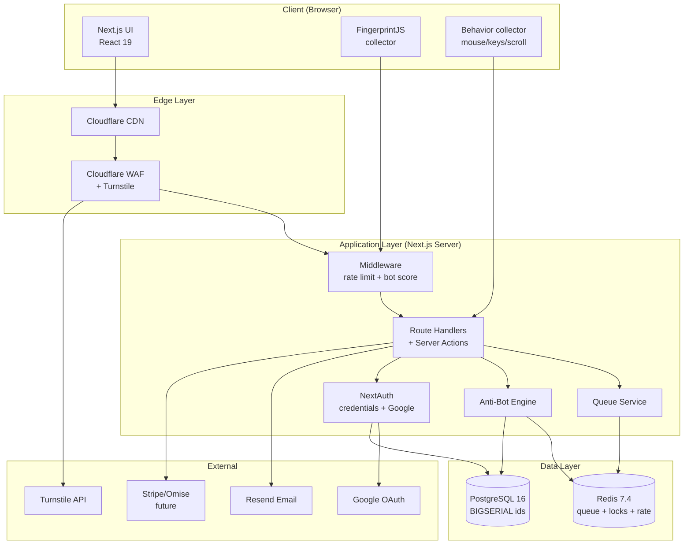

---

## 2. Use Case Diagram

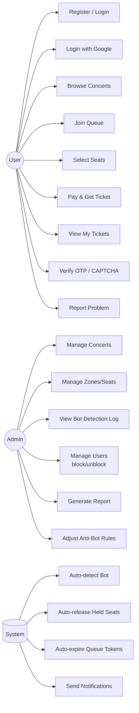

---

## 3. Sequence Diagram — Concert Ticket Purchase (Golden Path)

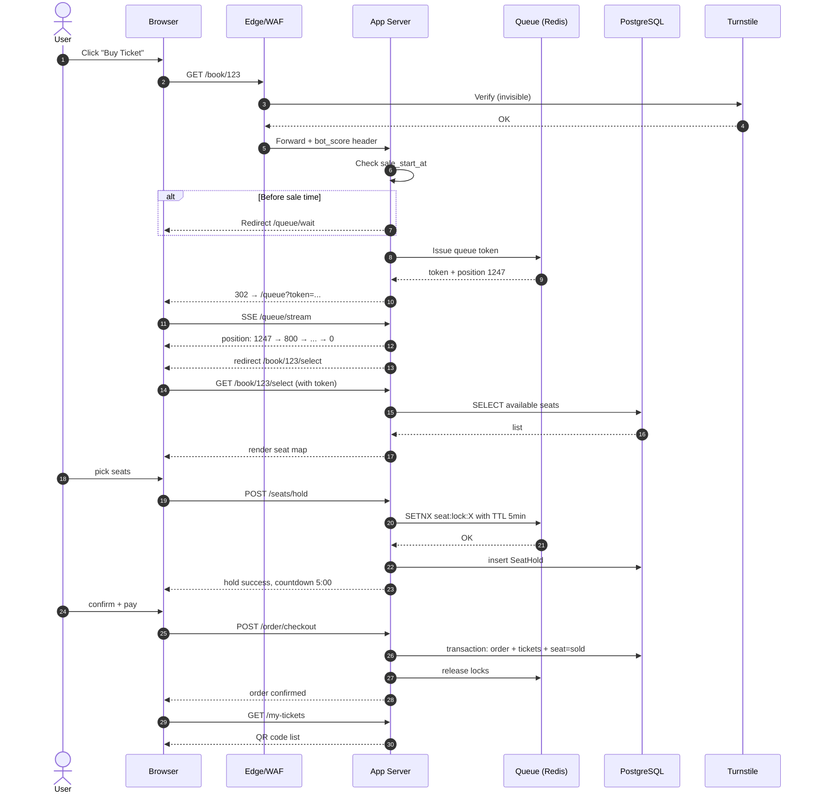

---

## 4. Anti-Bot Decision Flow

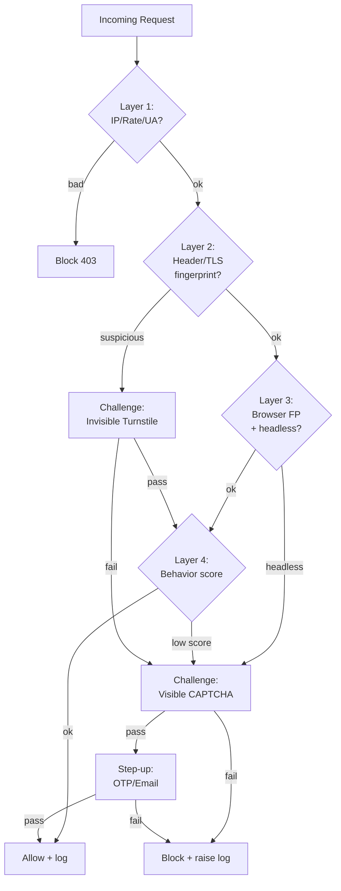

---

## 5. Data Flow Diagram (DFD Level 1)

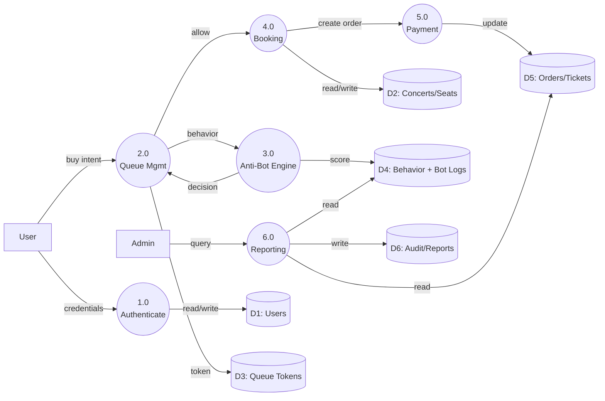

---

## 6. Component Diagram (Next.js Project Structure)

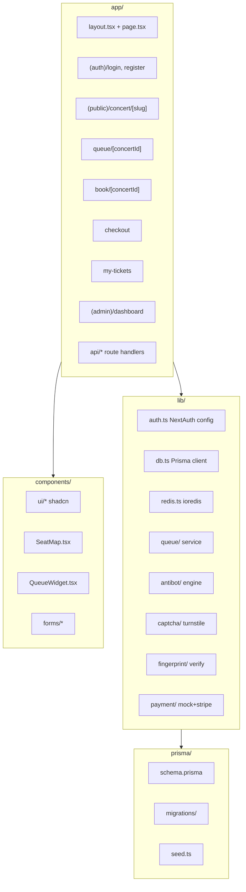

---

## 7. State Diagram — Order Lifecycle

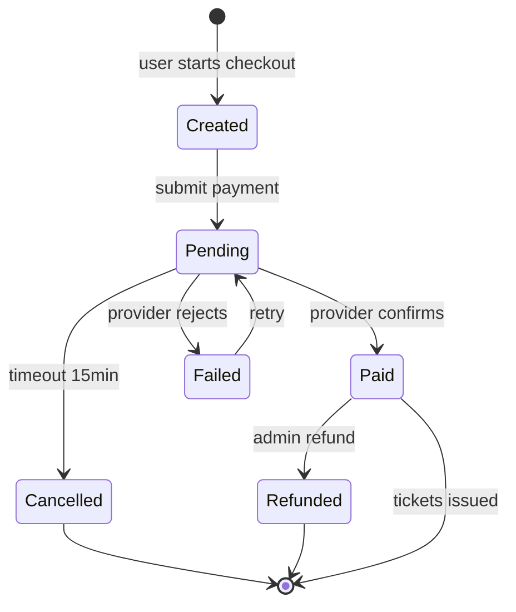

---

## 8. State Diagram — Seat Lifecycle

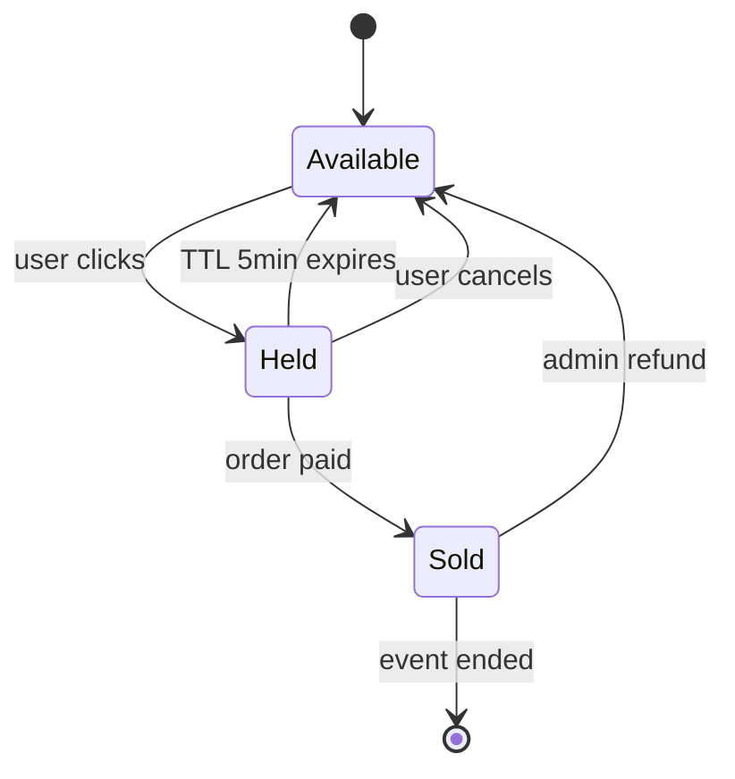

---

## 9. State Diagram — User Trust Score

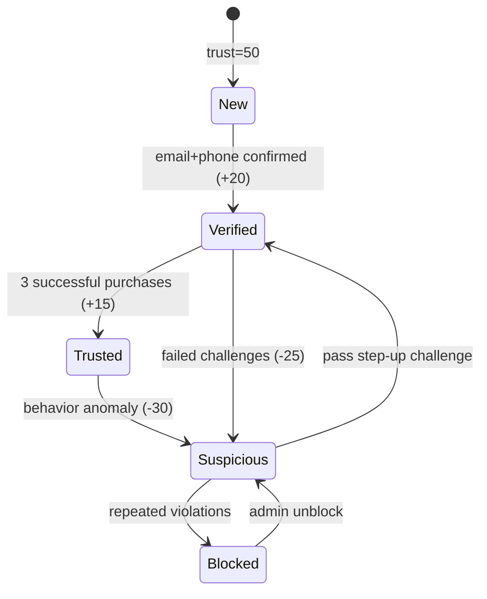

---

## 10. Deployment Diagram

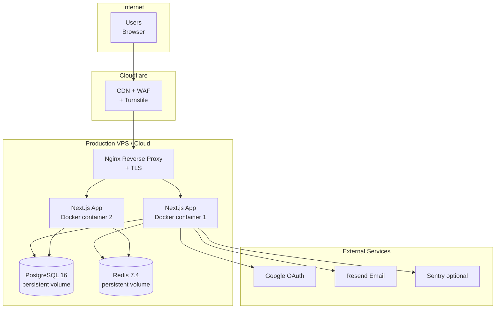

---

## 11. Gantt Chart — Project Timeline (สำหรับ thesis)

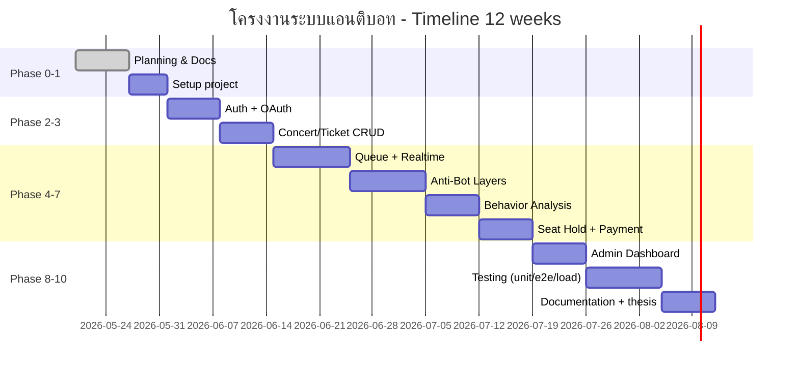

---

## 12. Diagram Checklist สำหรับเขียน thesis

| Chapter | Diagram ที่ต้องมี | สถานะ |
|---|---|---|
| 1 บทนำ | — | — |
| 2 ทบทวนวรรณกรรม | (มีจาก research เดิมแล้ว) | ✅ |
| 3 ขั้นตอนดำเนินงาน | Gantt (#11), System Architecture (#1), DFD (#5) | ✅ ในไฟล์นี้ |
| 3 ออกแบบระบบ | Use Case (#2), ER Diagram ([04](04_ER_DIAGRAM.md)), Sequence (#3), Anti-Bot Flow (#4) | ✅ |
| 3 รายละเอียดเพิ่ม | Component (#6), State diagrams (#7, #8, #9) | ✅ |
| 4 ผลและการทดสอบ | Screenshots + load test charts | ⏳ ทำตอน implement |
| 4 Deployment | Deployment (#10) | ✅ |

---

## 13. วิธี export เป็นรูป (สำหรับใส่ Word)

```bash
# install mermaid-cli
pnpm add -g @mermaid-js/mermaid-cli

# render diagram ทั้งไฟล์เป็น svg/png
mmdc -i docs/05_DIAGRAMS.md -o thesis/img/diagram-%d.png -t neutral -b white
```
