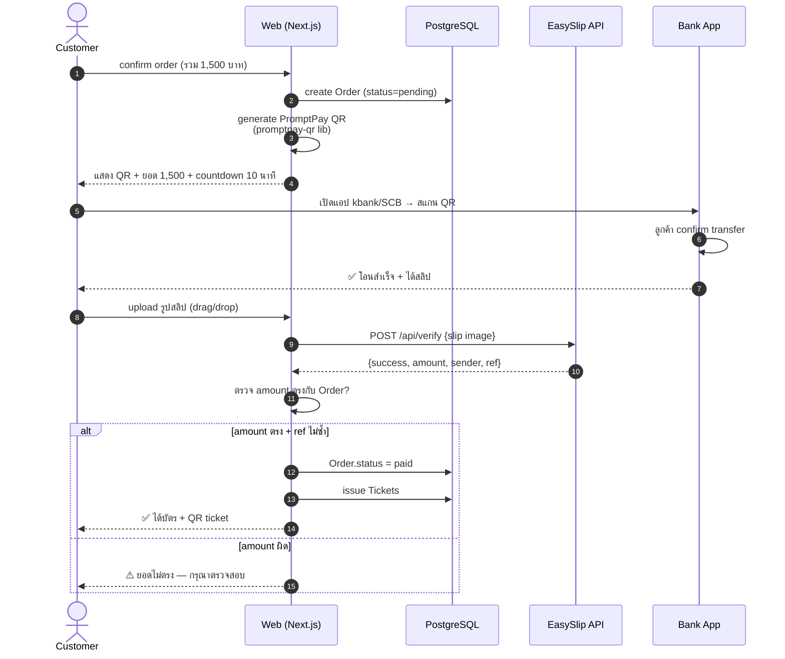

# 10 — Payment: ฟรี + เงินเข้าจริง (Real Money, Zero Cost)

> Requirements:
> - 💰 จ่ายเงินจริง **เงินต้องเข้าบัญชีจริงๆ** (เพื่อทดสอบ)
> - 🇹🇭 สกุลเงิน **บาท (THB)** เท่านั้น
> - 💸 **ไม่มีค่าใช้จ่าย** — paid provider ทำเป็น optional

---

## 1. ⭐ TL;DR: ใช้ PromptPay + Slip Verify

```
┌─────────────────────────────────────────────┐
│  PRIMARY (ฟรี 100% + เงินเข้าจริง)         │
├─────────────────────────────────────────────┤
│  📱 PromptPay QR (ผูกเบอร์/ID ของ user)    │
│     ↓                                       │
│  ลูกค้าสแกน → โอนเงินตรงเข้าบัญชี user      │
│     ↓                                       │
│  Upload สลิป → EasySlip API auto-verify     │
│     ↓                                       │
│  ระบบ mark order paid อัตโนมัติ             │
└─────────────────────────────────────────────┘

OPTIONAL (ถ้าอยากเพิ่มช่องทาง):
- 💳 บัตรเครดิต/เดบิต → Omise live (3.65% + 11 บ/tx)
- 💸 TrueMoney/Mobile Banking → Omise live (~3% /tx)
```

**ค่าใช้จ่ายของ PrimaryPath = 0 บาท** เงินเข้าบัญชี user 100%

---

## 2. ทำไม PromptPay + Slip Verify คือคำตอบ?

### 2.1 ข้อดี
| ข้อ | รายละเอียด |
|---|---|
| ✅ ฟรีทั้งหมด | ไม่มีค่า provider, ไม่มี % หัก, ไม่ต้องสมัครผู้ค้า |
| ✅ เงินเข้าจริง | โอนเข้าบัญชี user (บัญชีส่วนตัวก็ได้) |
| ✅ Test ได้ทันที | user โอน 1 บาทเข้าบัญชีตัวเอง = ทดสอบครบ flow |
| ✅ ทุกธนาคารใช้ได้ | ลูกค้าใช้ Kbank/SCB/BBL/etc สแกน QR เดียวกัน |
| ✅ Popular สุดในไทย | คนไทยใช้กัน 95%+ |
| ✅ ไม่ต้องจดทะเบียน | ผูก PromptPay กับเบอร์/ID เลย |
| ✅ Realtime | เงินเข้าบัญชีภายใน 2-3 วินาที |

### 2.2 ข้อเสีย (ที่ต้องรู้)
| ข้อ | ผลกระทบ | วิธีรับมือ |
|---|---|---|
| ⚠️ ไม่รองรับ international card | นักท่องเที่ยวต่างชาติจ่ายไม่ได้ | เพิ่ม Omise ทีหลังถ้าจำเป็น |
| ⚠️ ลูกค้าต้องสแกน + รอ + upload สลิป | UX ช้ากว่า card 30 วินาที | UI ออกแบบให้ smooth + auto-detect |
| ⚠️ Slip ปลอมได้ | ถ้าไม่ verify | ใช้ EasySlip API verify กับ BOT (ฟรี) |
| ⚠️ Limit PromptPay personal | จ่ายต่อครั้งไม่เกิน 50,000 บาท | สำหรับบัตรคอนเสิร์ตเพียงพอ |

---

## 3. Tech Stack สำหรับ PromptPay Flow

### 3.1 NPM Packages (ฟรีทั้งหมด)

```bash
pnpm add promptpay-qr qrcode sharp
```

| Package | Version | ใช้ทำอะไร |
|---|---|---|
| promptpay-qr | **0.5.x** | generate PromptPay payload string |
| qrcode | **1.5.x** | render เป็น PNG/SVG |
| sharp | **0.33.x** | optimize รูปสลิปก่อน upload |

### 3.2 Slip Verification API (เลือก 1)

| Provider | Free tier | เหตุผล |
|---|---|---|
| **EasySlip** ⭐ | 500 calls/เดือน ฟรี | TH-native, doc ไทย, ใช้งานง่าย — แนะนำ |
| SlipOK | 100 calls/วัน ฟรี | ใช้งานคล้าย EasySlip |
| RD Slip Verify | ฟรี (รัฐ) | ต้องสมัคร, doc น้อย |
| Manual (admin) | ฟรี | สำรอง — admin เข้าไปเช็คเอง |

> สำหรับ thesis: EasySlip 500/เดือนพอเหลือเฟือ

### 3.3 Free Database/Cache (ตามที่ plan)
- PostgreSQL (Docker, local) — ฟรี
- Redis (Docker, local) — ฟรี
- MinIO (Docker, local) — ฟรี เก็บรูปสลิป

---

## 4. ขั้นตอน Setup (User ต้องทำ 👤)

### Step 1: เปิด PromptPay กับบัญชีตัวเอง (5 นาที)
1. เปิด mobile banking ของธนาคารที่ใช้
2. ไปเมนู "บริการพร้อมเพย์" หรือ "PromptPay"
3. ผูกกับ **เบอร์มือถือ** หรือ **เลข บัตร ปชช.** (เลือกอย่างใดอย่างหนึ่ง)
4. รอ active (ส่วนใหญ่ทันที, บางธนาคารรอ 1 วัน)

> ✅ **ฟรี ไม่มีค่าใช้จ่าย, ไม่มีค่าบริการรายเดือน**

### Step 2: สมัคร EasySlip API (3 นาที)
1. ไป https://easyslip.com
2. กด Sign Up → กรอก email + password
3. Verify email
4. ไป Dashboard → Get API Key
5. Copy `EASYSLIP_API_KEY`
6. ส่ง key ให้ Claude

> ✅ **Free tier 500 calls/เดือน ไม่ใช้บัตรเครดิต**

### Step 3: ส่งให้ Claude
```env
PROMPTPAY_ID=0812345678          # เบอร์ หรือ เลข ปชช.
PROMPTPAY_NAME="ชื่อ-นามสกุล"     # แสดงในสลิป (optional)
EASYSLIP_API_KEY=es_xxxxxxxxxx
```

> 🔒 user ต้องเก็บ EASYSLIP_API_KEY เป็นความลับ — ห้าม commit เข้า git

---

## 5. Flow ทำงานจริง (Sequence)



---

## 6. Code Skeleton

### 6.1 Generate QR
```ts
// lib/payment/promptpay.ts
import generatePayload from 'promptpay-qr'
import QRCode from 'qrcode'

export async function generatePromptpayQR(amount: number) {
  const payload = generatePayload(process.env.PROMPTPAY_ID!, { amount })
  const dataUrl = await QRCode.toDataURL(payload, { width: 400 })
  return { payload, dataUrl }
}
```

### 6.2 Verify Slip
```ts
// lib/payment/easyslip.ts
export async function verifySlip(imageBuffer: Buffer, expectedAmount: number) {
  const formData = new FormData()
  formData.append('file', new Blob([imageBuffer]))

  const res = await fetch('https://developer.easyslip.com/api/v1/verify', {
    method: 'POST',
    headers: { Authorization: `Bearer ${process.env.EASYSLIP_API_KEY}` },
    body: formData,
  })
  const data = await res.json()

  if (data.status !== 200) throw new Error('สลิปไม่ถูกต้อง')

  const { amount, ref1, receiver, transDate } = data.data
  return {
    ok: amount.amount === expectedAmount,
    amount: amount.amount,
    ref: ref1,
    receiver: receiver.account.value,
    paidAt: new Date(transDate),
  }
}
```

### 6.3 Anti-duplicate (กันยิงสลิปซ้ำ)
```ts
// บันทึก ref ของทุกสลิปที่ verify สำเร็จ
// ถ้า ref เดียวกันมาอีก = ปลอม/ซ้ำ → reject
const existing = await db.payment.findFirst({ where: { provider_ref: ref } })
if (existing) throw new Error('สลิปนี้ถูกใช้แล้ว')
```

---

## 7. Test Plan (เงินจริง + จำนวนน้อย)

### 7.1 Smoke Test (1 บาท)
```
1. สร้าง demo concert ราคา 1 บาท
2. กดจอง → ได้ QR PromptPay 1 บาท
3. สแกนจากแอปธนาคารของตัวเอง → โอน 1 บาท เข้าบัญชีตัวเอง
   ✅ ฟรี! โอนตัวเอง ไม่เสียค่าธรรมเนียม
4. รับสลิป → upload
5. EasySlip verify → mark paid
6. ได้บัตร QR
```

> ทำซ้ำได้หลายรอบ — ทุกครั้ง 1 บาท ก็เป็น "real money" สำเร็จ

### 7.2 Multi-User Test (Demo Day)
- เพื่อน 5 คน โอนคนละ 5 บาท เข้าบัญชี user
- ทุกคนได้บัตร
- เงินรวม 25 บาท เข้าจริง → หลัง present คืนเงินทุกคน

### 7.3 Edge Cases
| Case | Expected |
|---|---|
| ยอดไม่ตรง | reject, แสดง error ภาษาไทย |
| สลิปเดิมส่งซ้ำ | reject "สลิปนี้ใช้แล้ว" |
| สลิปปลอม (Photoshop) | EasySlip detect ไม่ผ่าน |
| สลิปจากแอปไม่รองรับ | fallback admin manual verify |
| Timeout (เกิน 10 นาที) | release seat hold |

---

## 8. Optional Add-ons (มีก็ดี ถ้าไม่มีก็ใช้ได้)

> ทุก optional ด้านล่างนี้ **มีค่าใช้จ่ายตามการใช้งาน** — เพิ่มเมื่อจำเป็นเท่านั้น

### 8.1 Omise — บัตรเครดิต/เดบิต (สำหรับนักท่องเที่ยว)
- **ค่าใช้จ่าย:** 3.65% + 11 บ./tx (live mode)
- **Sandbox:** ฟรี 100% (test mode ใช้ บัตร 4242 4242 4242 4242)
- **Setup time:** สมัคร 5 นาที, KYC 3-7 วัน (สำหรับ live)
- **เหมาะกับ:** ลูกค้าต่างชาติ, คนไม่มี mobile banking

**ตัดสินใจ:** ถ้าใน thesis demo ไม่จำเป็น — **ข้าม** ใช้ PromptPay พอ

### 8.2 SlipOK — สำรองให้ EasySlip
- Free tier 100 calls/วัน
- ใช้เป็น fallback ถ้า EasySlip ล่ม

### 8.3 LINE Notify — แจ้งเตือนเงินเข้า
- ฟรี
- user รับ LINE message ทุกครั้งมี order ใหม่ payment confirmed

### 8.4 SCB Easy API / Kbank K-Cyber — Auto Slip Verify จาก Bank
- ต้องเป็น **บัญชีนิติบุคคล/SME** ถึงสมัครได้
- ฟรี
- Verify สลิปกับ BOT direct (เรียลไทม์ที่สุด)
- **ข้ามไป** สำหรับ student project

---

## 9. UI Mockup หน้าจ่ายเงิน

```
┌─────────────────────────────────────┐
│  💰 ชำระเงิน                        │
├─────────────────────────────────────┤
│  คอนเสิร์ต: BNK48 Concert           │
│  ที่นั่ง: VIP A1, A2 (2 ใบ)         │
│  ─────────────                      │
│  รวม:    1,500.00 บาท   🇹🇭        │
├─────────────────────────────────────┤
│       [ QR PromptPay ]              │
│         ┌─────────┐                 │
│         │ ▓▓▓ ▓▓▓ │                 │
│         │ ▓▓ █ ▓▓ │   1,500 บาท    │
│         │ ▓▓▓ ▓▓▓ │                 │
│         └─────────┘                 │
│                                     │
│  📱 สแกน QR ด้วยแอปธนาคาร           │
│  💸 โอน 1,500 บาท ตรงตามจำนวน      │
│  📸 ถ่าย/Screenshot สลิปแล้วอัปโหลด │
│                                     │
│  ⏱  เหลือเวลา: 09:32                │
├─────────────────────────────────────┤
│  [ 📸 อัปโหลดสลิป ]                 │
│  หรือ ลาก-วางที่นี่                  │
├─────────────────────────────────────┤
│  ผู้รับ: นาย/นางสาว XXXXXX (PromptPay) │
└─────────────────────────────────────┘
```

**Validation messages (ภาษาไทย):**
- ✅ "ตรวจสอบสลิปสำเร็จ — ออกบัตรให้แล้ว"
- ⚠️ "ยอดเงินไม่ตรงกับที่สั่ง"
- ⚠️ "สลิปนี้ถูกใช้แล้ว"
- ⚠️ "ไม่สามารถอ่านสลิปได้ — กรุณาลองใหม่"

---

## 10. Database Schema Update

```prisma
model Payment {
  payment_id     BigInt   @id @default(autoincrement())
  order_id       BigInt
  method         String   @default("promptpay")
                                          // promptpay / manual_transfer / omise_card / omise_truemoney
  amount         Decimal  @db.Decimal(10,2)
  currency       String   @default("THB")          // 🇹🇭 ล็อกเป็น THB
  status         String   @default("pending")
                                          // pending / verifying / success / failed / expired
  slip_image_url String?                            // path ใน MinIO
  slip_ref       String?  @unique                   // ref จากสลิป — UNIQUE กันใช้ซ้ำ
  slip_amount    Decimal? @db.Decimal(10,2)
  slip_sender    String?
  slip_paid_at   DateTime?
  verify_method  String?                            // easyslip / slipok / manual_admin
  verify_payload Json?                              // raw response
  expires_at     DateTime                           // 10 นาทีหลังสร้าง
  created_at     DateTime @default(now())
  updated_at     DateTime @updatedAt

  order Order @relation(fields: [order_id], references: [order_id])

  @@index([order_id])
  @@index([status, expires_at])
}
```

---

## 11. สรุปคำตอบของ User

### ❓ ใช้สกุลเงินอะไร?
✅ **THB (บาทไทย)** ทุก price, ทุก display, ทุก database field

### ❓ ค่าใช้จ่าย?
✅ **0 บาท** สำหรับ primary path (PromptPay + EasySlip free tier)
⚪ Optional: Omise 3.65% เฉพาะถ้าต้องการรับบัตรเครดิต

### ❓ เงินเข้าจริงมั้ย?
✅ **เข้าจริง 100%** เข้าบัญชีธนาคารของ user
✅ Test ได้โดยโอนตัวเองเอง 1 บาท (ฟรี, ทำซ้ำได้ไม่จำกัด)

### ❓ ทดสอบยังไง?
✅ Concert demo ราคา 1-5 บาท → user โอนเข้าบัญชีตัวเอง → verify ทำงาน → ออกบัตรจริง
✅ Demo day: เพื่อน/อาจารย์ โอน 5 บาท → ได้บัตรจริง → คืนเงินทีหลัง

---

## 12. Phase 7 (อัปเดต) — ใช้ PromptPay เป็นหลัก

| Step | งาน | ใคร | Cost |
|---|---|---|---|
| 7.1 | User เปิด PromptPay กับบัญชีตัวเอง | 👤 | ฟรี |
| 7.2 | User สมัคร EasySlip → API key | 👤 | ฟรี |
| 7.3 | Claude integrate promptpay-qr | 🤖 | ฟรี |
| 7.4 | Claude สร้าง slip upload + verify | 🤖 | ฟรี |
| 7.5 | Anti-duplicate (slip ref check) | 🤖 | ฟรี |
| 7.6 | Test ด้วย 1 บาท (โอนตัวเอง) | 🤝 | 0 บาท |
| 7.7 | Admin dashboard ดู payment + manual verify fallback | 🤖 | ฟรี |
| 7.8 | (optional) เพิ่ม Omise card | 🤖 + 👤 | ทำเฉพาะถ้าต้องการ |
