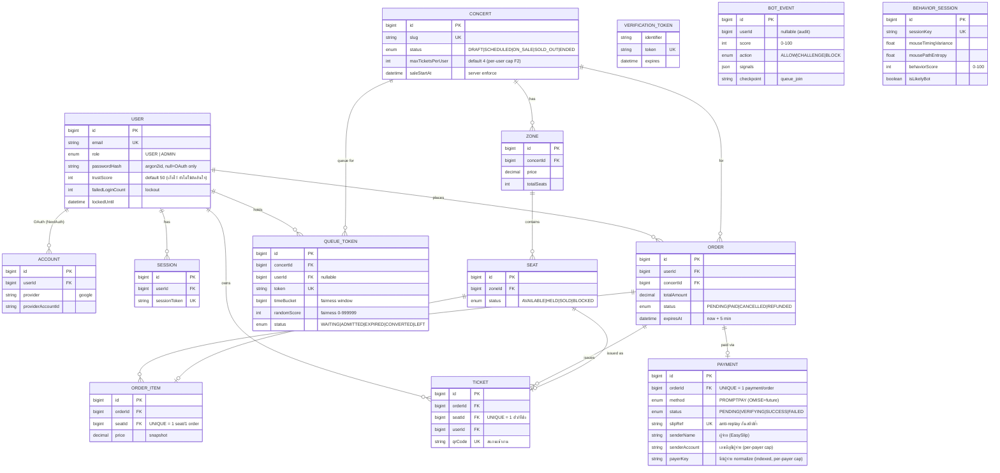

# 📘 THESIS GUIDE — Material รวมศูนย์สำหรับทำรูปเล่มปริญญานิพนธ์

> **เริ่มอ่านที่ไฟล์นี้ไฟล์เดียว** — รวม "ข้อเท็จจริงที่ถูกต้อง + แผนที่เอกสาร→บทในเล่ม + ER ที่ตรงโค้ด + สิ่งที่ต้องแก้ก่อนเข้าเล่ม" ไว้ที่เดียว
> โปรเจกต์: **ระบบจองบัตรคอนเสิร์ตที่มีระบบป้องกันบอท** (Next.js 15 + Prisma/PostgreSQL + Redis)
> อัปเดต: **2026-06-06** · ตรวจเทียบโค้ดจริงด้วย multi-agent audit (พบ **90 จุด**ที่เอกสารไม่ตรงโค้ด)

---

## 0. ทำไมต้องมีไฟล์นี้ (อ่านก่อน)

เอกสารใน `docs/` ส่วนใหญ่เขียน **ช่วงวางแผน (พ.ค. 2026)** แล้วระบบพัฒนาเดินหน้าไปไกลกว่าแผนเดิมมาก → เอกสารหลายจุด **"ไม่ตรงกับโค้ดจริง"** เช่น เคลมว่า anti-bot มี 8 ชั้น (จริง 2), unit test 9/9 (จริง 101), ใช้ Stripe/SSE (จริงไม่มี)

ถ้ายกเอกสารเก่าเข้าเล่มดิบ ๆ **กรรมการเปิดโค้ดเทียบแล้วจับได้ทันที** ไฟล์นี้จึงทำหน้าที่:

1. **§1 ข้อเท็จจริงที่ถูกต้อง** — ยึดตารางนี้เวลาเขียนเล่ม (อย่าลอกตัวเลขเก่าจาก doc อื่น)
2. **§2 แผนที่ เอกสาร → บทในเล่ม** — อ่านลำดับไหน, ไฟล์ไหนเข้าเล่ม/ไม่เข้า
3. **§3 ER Diagram ที่ถูกต้อง** — regenerate จาก `prisma/schema.prisma` จริง
4. **§4 สถานะรายเอกสาร** — แต่ละไฟล์ต้องแก้อะไรก่อนเข้าเล่ม
5. **§5 Checklist แก้ก่อนเข้าเล่ม** — เรียงตามความสำคัญ
6. **§6 โค้ดจริง** — feature ไหนอยู่ไฟล์ไหน (ใช้อ้างอิงตอนเขียน + ตอน defense)

---

## 1. ✅ ข้อเท็จจริงที่ถูกต้อง (Canonical Facts)

> **กฎ: เวลาเขียนเล่ม ยึดคอลัมน์ "ของจริง" — ห้ามลอกคอลัมน์ "เคยเขียนผิด"**

| หัวข้อ | ✅ ของจริง (ยึดอันนี้) | หลักฐานในโค้ด | ❌ ที่เอกสารเก่าเขียนผิด |
|---|---|---|---|
| **Anti-bot กี่ชั้น** | **2 ชั้น** — Layer 1 scoring + Layer 2 behavior | `lib/antibot.ts`, `lib/behavior.ts` | "8 ชั้น" / "4 ชั้น" (00,01,02,03,07,08 + `package.json`) |
| **Layer 1** | รวม 4 สัญญาณเป็นคะแนนเดียว (Turnstile + UA keyword + header ครบ + มี fingerprint) → score 0-100 → **ALLOW <40 / CHALLENGE 40-69 / BLOCK ≥70** | `lib/antibot.ts:36-37, 69-124` | วาดเป็น 4 ชั้นแยก (TLS/headless/IP-reputation) ที่ไม่มีจริง |
| **Layer 2** | behavior (เมาส์/timing/entropy) → escalate-only: ยกได้แค่ **ALLOW→CHALLENGE ไม่เคย block** | `lib/behavior.ts`, `app/api/queue/join/route.ts:115-123` | เคลมว่า "จับบอทได้" (จริง = signal เสริม, spoof ได้) |
| **Unit tests** | **101/101 ผ่าน** (11 ไฟล์) | `tests/unit/*.test.ts` · `pnpm test:run` | "9/9" (00,01,08,13,14) — ผิด ~10 เท่า |
| **Integration tests** | **11/11 ผ่าน** (N1/N3 race + per-payer cap, Postgres จริง) | `scripts/test-n1-race.ts` · `pnpm test:race` | (ไม่เคยกล่าวถึง) |
| **tsc** | **0 errors** | `pnpm typecheck` | — |
| **Payment** | **PromptPay QR + EasySlip verify** (fail-closed บน prod) | `lib/promptpay.ts`, `lib/easyslip.ts` | "Stripe / Omise / mock" (02,05,07,08,09) |
| **Anti-account-farming** | per-user cap (F2) **+ per-payer cap ใหม่** (จำกัดตั๋วต่อบัญชีผู้จ่าย ข้ามทุก account) | `lib/ticket-limit.ts`, `lib/payer-key.ts`, `lib/order-finalize.ts`, `Payment.payerKey` | — |
| **Seat hold** | **Redis SET NX** (TTL 300s) — ไม่ใช่ตาราง DB | `lib/seat-hold.ts:50` | "ตาราง SeatHold" + "Postgres SELECT FOR UPDATE" (ไม่มีในโค้ด) |
| **คิว (delivery)** | **HTTP polling แบบ backoff** ตามตำแหน่งคิว | `components/waiting-room.tsx`, `app/api/queue/status/route.ts` | "SSE / WebSocket real-time" (01,05,09) — ไม่มีในโค้ด |
| **คิว (fairness)** | `timeBucket` + `randomScore` (สุ่มในช่วงเวลา ไม่เอาความเร็ว ms) | `prisma/schema.prisma:294-295`, `lib/queue.ts` | — |
| **Database** | **14 Prisma models** (ดู §3) | `prisma/schema.prisma` | มี "ตารางผี" 6 ตัว: Admin/SeatHold/BehaviorEvent/BotDetectionLog/Report/AuditLog |
| **Authorization** | `role` enum (USER/ADMIN) บน User + `requireAdmin()` + `app/(admin)/layout.tsx` | `prisma/schema.prisma:35,55-58` | "ตาราง Admin แยก" |
| **Email** | Resend ผ่าน **REST fetch** (ไม่ลง SDK) | `lib/email.ts` | "Resend SDK + react-email" |
| **Rate limit** | เขียนเอง Redis sliding-window (ZSET) | `lib/rate-limit.ts` | "@upstash/ratelimit" (ไม่มีใน deps) |
| **Stack** | lean ~13 deps: Next 15.1.0, React 19, Prisma 6.1, ioredis, next-auth v5-beta, argon2, promptpay-qr, qrcode, zod, lucide-react | `package.json` | BullMQ / aws-sdk / isbot / sharp-import / Sentry (ไม่มี) |
| **trustScore** | คอลัมน์ default 50 — **มีแต่ไม่ถูกใช้ตัดสินใจ** | `prisma/schema.prisma:37` | "Trust Score state machine (Verified→Trusted→Blocked)" — ไม่มีจริง |

### ❌ สิ่งที่ "ยังไม่ได้ทำ" — ห้ามเขียนในเล่มว่าทำแล้ว
anti-bot 8 ชั้น · SSE/WebSocket · Postgres SELECT FOR UPDATE · Stripe/Omise · Trust-score state machine · OTP/SMS · ตาราง SeatHold/Report/AuditLog · health endpoint (`/api/health`) · CSP header · Puppeteer bot-simulator

> ของพวกนี้เขียนเป็น **"งานในอนาคต (Future Work)"** ได้ แต่ต้องบอกชัดว่า **ยังไม่ทำ**

---

## 2. 🗺️ แผนที่: เอกสาร → บทในรูปเล่ม

> สถานะ: ✅ ใช้ได้เลย · ⚠️ ต้องแก้ก่อน (ดู §5) · 📋 process ภายใน (ไม่เข้าเล่ม)

| บทในเล่ม (ป.ตรี) | เอกสารหลัก | สถานะ | โค้ดอ้างอิง |
|---|---|---|---|
| **บทที่ 1 — บทนำ / ขอบเขต** | [01_PLAN](01_PLAN.md), [11_REQUIREMENTS](11_REQUIREMENTS.md) | ⚠️ แก้ตัวเลข+ชั้น | — |
| **บทที่ 2 — ทฤษฎี / งานวิจัยที่เกี่ยวข้อง** | [06_RESEARCH_SUMMARY](06_RESEARCH_SUMMARY.md) | ⚠️ แก้ตารางเทียบ schema | — |
| **บทที่ 3 — ออกแบบ / วิธีดำเนินงาน** | [04_ER_DIAGRAM](04_ER_DIAGRAM.md), [05_DIAGRAMS](05_DIAGRAMS.md), [03_TOOLS_AND_VERSIONS](03_TOOLS_AND_VERSIONS.md), [10_PAYMENT_PROVIDERS](10_PAYMENT_PROVIDERS.md), [15_PAYMENT_SECURITY](15_PAYMENT_SECURITY.md), [16_PEAK_LOAD](16_PEAK_LOAD.md) | ⚠️ 04/05 ต้องแก้หนัก · 15/16 ดี | `prisma/`, `lib/`, `app/` |
| ↳ scope decisions (ของเสริมบทที่ 1/3) | [02_RECOMMENDATIONS](02_RECOMMENDATIONS.md) | ⚠️ mark DONE/ตัด/เลื่อน | — |
| **บทที่ 4 — ผลการดำเนินงาน** | [13_THESIS_EVALUATION](13_THESIS_EVALUATION.md) | ⚠️ **แก้ตัวเลขก่อน (สำคัญสุด)** | `tests/`, `tests/load/` |
| **บทที่ 5 — สรุป + ข้อเสนอแนะ** | สังเคราะห์จาก §1 + [15 §ข้อจำกัด](15_PAYMENT_SECURITY.md) | ✍️ เขียนใหม่ | — |
| **ภาคผนวก** | [12_CHANGELOG](12_CHANGELOG.md), [17_GO_LIVE_CHECKLIST](17_GO_LIVE_CHECKLIST.md), screenshots | ✅ | — |
| **📋 ไม่เข้าเล่ม (process)** | [00_README](00_README.md), [07_RESPONSIBILITIES](07_RESPONSIBILITIES.md), [08_VERIFICATION](08_VERIFICATION.md), [09_LOCAL_PRESENTATION](09_LOCAL_PRESENTATION.md), [14_SCREENSHOTS_GUIDE](14_SCREENSHOTS_GUIDE.md) | 📋 | — |

> **08_VERIFICATION** = self-audit ช่วงก่อนเขียนโค้ด (2026-05-25) → stale ทั้งใบ ใช้เป็นหลักฐานเชิงประวัติเท่านั้น **อย่าเข้าเล่ม** — ถ้าต้องการบท "การทดสอบ/ตรวจสอบ" ให้เขียนใหม่จาก §1 + ผลรันจริง

---

## 3. 🗂️ ER Diagram ที่ถูกต้อง (จาก `prisma/schema.prisma` จริง — 14 models)

> ⚠️ ER ใน [04_ER_DIAGRAM.md](04_ER_DIAGRAM.md) ปัจจุบัน **ผิด** (มีตารางผี 6 ตัว, ตั้งชื่อ PK/column ผิด) — ใช้รูปด้านล่างนี้แทน

**หมายเหตุสำคัญ (ใส่ใต้รูปในเล่ม):**
- **ไม่มีตาราง SeatHold** — การจองชั่วคราว (hold) อยู่ใน **Redis** (`SET NX` TTL 300s) เพื่อความเร็ว/atomic; DB เก็บแค่ `Seat.status = HELD` ตอนยืนยันจ่ายเงิน
- **`BOT_EVENT` + `BEHAVIOR_SESSION` เป็นตาราง audit/telemetry แบบยืนอิสระ** (ไม่มี FK ผูก) — เก็บผลประเมินบอท Layer 1/2 ไว้ทำ dashboard + วิเคราะห์
- **per-payer cap** ใช้ `Payment.payerKey` (มี index) นับตั๋วต่อ "บัญชีผู้จ่าย" ข้ามทุก account — กัน account farming ที่ชั้นจ่ายเงิน (ชั้นที่บอทปลอมไม่ได้)

---

## 4. 📋 สถานะรายเอกสาร + ต้องแก้อะไร

| Doc | เข้าเล่ม? | สถานะ | ต้องแก้อะไรก่อนเข้าเล่ม (สรุปจาก audit) |
|---|:---:|:---:|---|
| 00_README | 📋 | update | 8→2 ชั้น, 9/9→101, เพิ่ม doc 16-17, ลบ framing "รอ approve เริ่ม Phase 1" |
| 01_PLAN | ✅ | ⚠️ | 9/9→101, "4-8 ชั้น"→2 ชั้น, ตัด "SELECT FOR UPDATE" (จริง Redis NX), ตัด SSE, ตัด Stripe |
| 02_RECOMMENDATIONS | ⚠️ | update | ตาราง 8 ชั้น = roadmap (mark ว่ายังไม่ทำ), แก้รายชื่อตาราง/route, ลบ "Omise จริง" |
| 03_TOOLS | ✅ | ⚠️ | §15 ตัด phantom deps (BullMQ/isbot/@upstash/aws-sdk/Resend SDK), sync เวอร์ชันจาก package.json จริง |
| 04_ER_DIAGRAM | ✅ | ⚠️ **หนัก** | **ใช้ ER ใน §3 แทน** — ของเดิมมีตารางผี 6 ตัว + ชื่อผิดทั้งฉบับ |
| 05_DIAGRAMS | ✅ | ⚠️ **หนัก** | redraw: payment→PromptPay/EasySlip, คิว→polling (ไม่ใช่ SSE), anti-bot→2 ชั้น, ถอด Trust-score state, order timeout 5 นาที |
| 06_RESEARCH_SUMMARY | ✅ | ⚠️ | narrative ดี — แก้ "ส่วนที่ 4 ตารางเทียบ schema" ให้ตรง 14 models |
| 07_RESPONSIBILITIES | 📋 | update | 4-8 ชั้น→2, ตัด Stripe/Omise/R2/Upstash/OTP |
| 08_VERIFICATION | 📋 | **archive** | stale ทั้งใบ (วัดก่อนเขียนโค้ด) — อย่าเข้าเล่ม |
| 09_LOCAL_PRESENTATION | 📋 | update | payment→PromptPay, ตัด SSE, แก้ script `dev:lan` ที่ไม่มีจริง |
| 10_PAYMENT_PROVIDERS | ✅ | minor | โครงดี (PromptPay+EasySlip) — sync code skeleton ให้ตรง lib จริง |
| 11_REQUIREMENTS | ✅ | review* | (audit ไม่ทัน) — ตรวจ "8 ชั้น"/ตัวเลข ให้ตรง §1 |
| 12_CHANGELOG | ภาคผนวก | keep | source of truth ของ timeline — เพิ่ม rev per-payer cap |
| 13_THESIS_EVALUATION | ✅ | ⚠️ **สำคัญสุด** | **แก้ตัวเลข**: 9/9→101, inversion 96.8% (วัดจาก script ที่เขียนสูตรซ้ำ — ต้อง re-run จริงหรือถอด), 22 routes |
| 14_SCREENSHOTS_GUIDE | 📋 | update | 9/9→101, "160 available"→BTS 80 ON_SALE, /checkout/[id]→[orderId] |
| 15_PAYMENT_SECURITY | ✅ | minor | ดี/current — **เพิ่มหัวข้อ per-payer cap** (มาตรการใหม่) |
| 16_PEAK_LOAD | ✅ | keep | current (2026-06-04) |
| 17_GO_LIVE_CHECKLIST | ภาคผนวก | minor | แก้ "repo ยัง 0 commit" (จริงมี 3+ commits) |

\* 11/12/13/15/16/17 = agent audit ไม่ทัน (timeout) — สถานะจากการอ่านเอง

---

## 5. 🔴 Checklist "แก้ก่อนเข้าเล่ม" (เรียงตามความเสี่ยงโดนกรรมการจับ)

### 🔴 HIGH — แก้ก่อนสุด (กรรมการเปิดโค้ดเจอทันที)
- [ ] **ตัวเลขทดสอบทุกที่**: `9/9` → **`101/101 unit + 11/11 integration`** (ไฟล์ 00,01,08,13,14)
- [ ] **จำนวนชั้น anti-bot ทุกที่**: `8 ชั้น`/`4 ชั้น` → **`2 ชั้น`** (Layer 1 scoring + Layer 2 behavior) — รวม `package.json` description ด้วย
- [ ] **ER diagram (04)**: แทนด้วย §3 (ของเดิมมีตารางผี 6 ตัว)
- [ ] **13_THESIS_EVALUATION (บทผลการทดลอง)**: ตัวเลข `inversion 96.8%` วัดจากสคริปต์ที่เขียนสูตรซ้ำในตัวเทสต์ + เทียบ index ใน `Promise.all` ไม่ใช่เวลามาถึงจริง → **ตัดสินใจ: re-run ให้ได้ค่าจริง หรือถอดออก** (อย่าปล่อยเป็นค่าตายตัวที่พิสูจน์ไม่ได้)
- [ ] **05_DIAGRAMS**: ลบ Stripe/Omise, SSE, Trust-score state machine, 4-layer flow

### 🟡 MED
- [ ] 03_TOOLS §15: ตัด dependency ที่ไม่ได้ลงจริง (BullMQ/isbot/@upstash/aws-sdk/Resend SDK) — เล่าเป็นจุดแข็ง "lean dependency" แทน
- [ ] 02/06: แก้รายชื่อตาราง DB ให้ตรง 14 models (§3)
- [ ] 01_PLAN: ตัด "SELECT FOR UPDATE" + SSE + section "รอ approve เริ่ม Phase 1"
- [ ] เพิ่ม **per-payer cap** เข้า 15_PAYMENT_SECURITY + ER + บทผล

### 🟢 LOW
- [ ] 17: แก้ "repo 0 commit" → มี commits แล้ว
- [ ] 14: "160 available"→ BTS 80 ON_SALE, route param `[orderId]`
- [ ] 00: เพิ่ม doc 16-17 ในสารบัญ

---

## 6. 🔗 โค้ดจริง (feature → ไฟล์) — ใช้ตอนเขียน/ตอน defense

| ระบบ | ไฟล์หลัก |
|---|---|
| **Anti-bot Layer 1** (scoring) | `lib/antibot.ts` (`assessRequest`, threshold 40/70) · test `tests/unit/antibot.test.ts` |
| **Anti-bot Layer 2** (behavior) | `lib/behavior.ts` (`analyzeBehavior`) · `app/api/queue/join/route.ts:115-123` (escalate-only) |
| **CAPTCHA** | `lib/turnstile.ts` (Cloudflare Turnstile, fail-closed prod) |
| **คิว / fairness** | `lib/queue.ts` (`joinQueue`/`admitNext`/`isAdmitted`) · `components/waiting-room.tsx` (polling) |
| **Rate limit / load shed** | `lib/rate-limit.ts` (Redis ZSET) · `lib/load-shed.ts` |
| **Seat hold** | `lib/seat-hold.ts` (Redis SET NX) |
| **Payment verify** | `lib/easyslip.ts` · `lib/promptpay.ts` · `lib/slip-match.ts` · `lib/slip-freshness.ts` · test `tests/unit/easyslip.test.ts` |
| **ออกตั๋ว / race-safe / per-payer cap** | `lib/order-finalize.ts` (`finalizePaidOrder`) · `lib/payer-key.ts` · `app/actions/booking.ts` · test `scripts/test-n1-race.ts` |
| **ticket limit (per-user)** | `lib/ticket-limit.ts` (F2) |
| **Auth / RBAC** | `lib/auth.ts` · `auth.config.ts` · `app/(admin)/layout.tsx` (`requireAdmin`) |
| **Schema / migrations** | `prisma/schema.prisma` (14 models) · `prisma/migrations/` (6 migrations) |
| **CI** | `.github/workflows/ci.yml` (typecheck + unit + integration กับ Postgres) |

> **ความปลอดภัยเรื่องเงิน + ข้อจำกัด (สำหรับบทสรุป/defense):** ดู [15_PAYMENT_SECURITY.md](15_PAYMENT_SECURITY.md) — threat model T1-T10, fix F1-F8/H1-H4/N1-N5, per-payer cap, และ **ข้อจำกัดที่ยอมรับตรง ๆ** (ขบวนการที่มีหลายบัญชีธนาคารจริงยังเลี่ยงได้ → identity binding เป็น future work)
